# RISC-V 5-Stage Pipelined Processor — Specification

## Tổng quan kiến trúc

Thiết kế này là một bộ xử lý RISC-V RV32I 5 tầng pipeline, bao gồm:
- 5 tầng pipeline: **IF → ID → EX → MEM → WB**
- **Hazard Unit**: forwarding (MEM→EX, WB→EX), stall (load-use), flush (branch/jump)
- **L1 I-Cache** và **L1 D-Cache** direct-mapped 16 line, write-back, AXI4-Lite master
- **AXI4-Lite Interconnect** 2M→1S + **AXI SRAM Wrapper** → **EF_SRAM 1024×32**
- **CSR File**: mstatus, mtvec, mscratch, mepc, mcause + ECALL/MRET

---

## 1. Top Module — `riscv_pipeline_top`

### Bảng tín hiệu

| Tên | Hướng | Rộng | Ý nghĩa |
|---|---|---|---|
| `clk` | Input | 1 | Clock hệ thống |
| `rst` | Input | 1 | Reset tích cực thấp (0 = reset) |

> Module top không có output ra ngoài; tất cả giao tiếp nội bộ qua wire.

### Nguyên lý hoạt động

`riscv_pipeline_top` là module kết nối, không chứa logic. Nó khởi tạo và nối dây:
1. **Fetch Stage** → **Pipeline Reg F/D** → **Decode Stage** → **Pipeline Reg D/E** → **Execute Stage** → **Pipeline Reg E/M** → **Memory Stage** → **Pipeline Reg M/W** → **Writeback Stage**
2. **Hazard Unit** nhận tín hiệu từ tất cả các tầng và xuất `stall_*`, `flush_*`, `forward_*`
3. **L1 I-Cache / D-Cache** → **AXI Interconnect** → **AXI SRAM Wrapper** → **EF_SRAM**
4. **CSR File** đọc từ tầng Decode, ghi từ tầng Writeback

#### Sơ đồ kiến trúc tổng thể

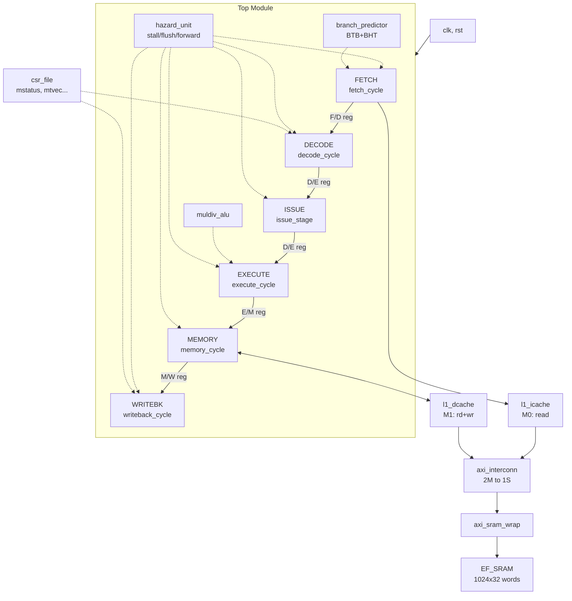
```mermaid
graph TD
    clk[clk, rst] --> TOP[riscv_pipeline_top]
    
    subgraph TOP[Top Module]
        IF[FETCH<br>fetch_cycle] -->|F/D reg| ID[DECODE<br>decode_cycle]
        ID -->|D/E reg| ISS[ISSUE<br>issue_stage]
        ISS -->|D/E reg| EX[EXECUTE<br>execute_cycle]
        EX -->|E/M reg| MEM[MEMORY<br>memory_cycle]
        MEM -->|M/W reg| WB[WRITEBK<br>writeback_cycle]
        
        MULDIV[muldiv_alu] -.-> EX
        
        HZ[hazard_unit<br>stall/flush/forward]
        HZ -.-> IF
        HZ -.-> ID
        HZ -.-> ISS
        HZ -.-> EX
        HZ -.-> MEM
        HZ -.-> WB
        
        BP[branch_predictor<br>BTB+BHT] -.-> IF
    end
    
    IF --> IC[l1_icache<br>M0: read]
    MEM <--> DC[l1_dcache<br>M1: rd+wr]
    
    IC --> AXI[axi_interconn<br>2M to 1S]
    DC --> AXI
    
    AXI --> SRAM_W[axi_sram_wrap]
    SRAM_W --> SRAM[EF_SRAM<br>1024x32 words]
    
    CSR[csr_file<br>mstatus, mtvec...] -.-> ID
    CSR -.-> WB
```

---

## 2. Tầng Fetch — `fetch_cycle`

### Bảng tín hiệu

| Tên | Hướng | Rộng | Ý nghĩa |
|---|---|---|---|
| `clk` | Input | 1 | Clock |
| `rst` | Input | 1 | Reset tích cực thấp |
| `en` | Input | 1 | Enable PC (= `~stall_f` từ Hazard Unit) |
| `pc_src_e` | Input | 1 | 1 = chọn `pc_target_e` thay vì PC+4 |
| `pc_target_e` | Input | 32 | PC đích khi branch/jump |
| `is_ecall` | Input | 1 | 1 = đang có ECALL → nạp `trap_vec` |
| `is_mret` | Input | 1 | 1 = đang có MRET → nạp `epc` |
| `trap_vec` | Input | 32 | Địa chỉ trap handler (từ CSR mtvec) |
| `epc` | Input | 32 | Địa chỉ trở về sau trap (từ CSR mepc) |
| `instr_f_in` | Input | 32 | Lệnh đọc từ I-Cache |
| `predict_taken_f_in` | Input | 1 | Dự đoán nhảy từ Branch Predictor |
| `predict_target_f_in` | Input | 32 | Địa chỉ đích dự đoán từ Branch Predictor |
| `instr_f` | Output | 32 | Lệnh cho pipeline reg F/D |
| `pc_f` | Output | 32 | PC hiện tại |
| `pc_plus_4_f` | Output | 32 | PC + 4 |
| `predict_taken_f` | Output | 1 | Dự đoán nhánh (đẩy vào pipeline) |
| `predict_target_f` | Output | 32 | Địa chỉ đích dự đoán (đẩy vào pipeline) |

### Nguyên lý hoạt động

```
pc_next_predict = predict_taken_f_in ? predict_target_f_in : pc_plus_4_f
pc_next_normal = pc_src_e ? pc_target_e : pc_next_predict
pc_next_final  = is_ecall ? trap_vec :
                 is_mret  ? epc      : pc_next_normal
PC            ← pc_next_final  (khi en=1)
```

PC chỉ cập nhật khi `en=1`. Khi `stall_f=1` (từ Hazard Unit), `en=0`, PC đóng băng.

#### Sơ đồ logic tầng Fetch

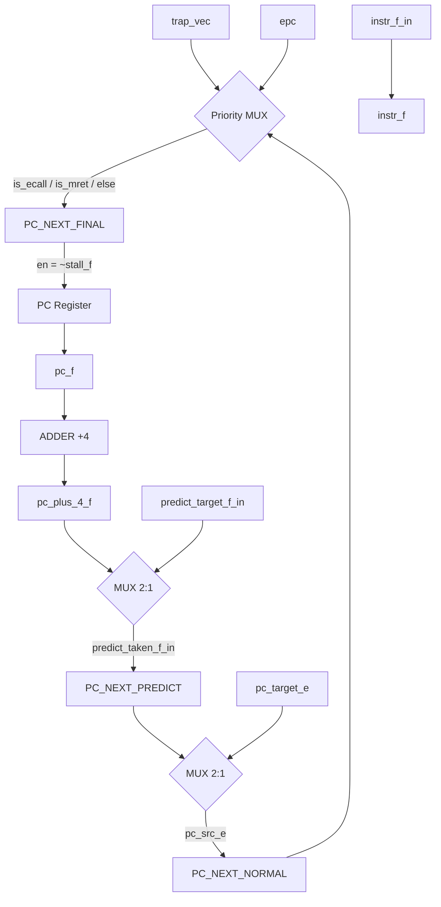
```mermaid
graph TD
    TV[trap_vec] --> MUX1{Priority MUX}
    EPC[epc] --> MUX1
    
    PC4[pc_plus_4_f] --> MUX2{MUX 2:1}
    PCT[predict_target_f_in] --> MUX2
    
    MUX2 -->|predict_taken_f_in| PC_NEXT_PREDICT
    
    PC_NEXT_PREDICT --> MUX3{MUX 2:1}
    PCT_E[pc_target_e] --> MUX3
    MUX3 -->|pc_src_e| PC_NEXT_NORMAL
    
    PC_NEXT_NORMAL --> MUX1
    MUX1 -->|is_ecall / is_mret / else| PC_NEXT_FINAL
    
    PC_NEXT_FINAL -->|en = ~stall_f| PC[PC Register]
    PC --> PC_OUT[pc_f]
    PC_OUT --> ADD[ADDER +4]
    ADD --> PC4
    
    I[instr_f_in] --> IOUT[instr_f]
```

---

## 3. Tầng Decode — `decode_cycle`

### Bảng tín hiệu

| Tên | Hướng | Rộng | Ý nghĩa |
|---|---|---|---|
| `clk` | Input | 1 | Clock |
| `rst` | Input | 1 | Reset |
| `reg_write_w` | Input | 1 | Enable ghi thanh ghi (từ WB) |
| `rd_w` | Input | 5 | Địa chỉ thanh ghi đích (từ WB) |
| `instr_d` | Input | 32 | Lệnh từ pipeline reg F/D |
| `result_w` | Input | 32 | Dữ liệu ghi vào thanh ghi (từ WB) |
| `pc_in` | Input | 32 | PC (không dùng trực tiếp trong module) |
| `pc_plus_4_in` | Input | 32 | PC+4 (không dùng trực tiếp) |
| `imm_ext_d` | Output | 32 | Immediate mở rộng dấu |
| `read_data_1_d` | Output | 32 | Dữ liệu đọc từ rs1 |
| `read_data_2_d` | Output | 32 | Dữ liệu đọc từ rs2 |
| `rs1_d` | Output | 5 | Địa chỉ rs1 (instr[19:15]) |
| `rs2_d` | Output | 5 | Địa chỉ rs2 (instr[24:20]) |
| `rd_d` | Output | 5 | Địa chỉ rd (instr[11:7]) |
| `reg_write_d` | Output | 1 | Tín hiệu ghi thanh ghi |
| `mem_write_d` | Output | 1 | Tín hiệu ghi bộ nhớ |
| `jump_d` | Output | 1 | Lệnh JAL/JALR |
| `branch_d` | Output | 1 | Lệnh branch |
| `alu_src_d` | Output | 1 | 0=rs2, 1=immediate |
| `jalr_d` | Output | 1 | Lệnh JALR cụ thể |
| `funct3_d` | Output | 3 | funct3 của lệnh |
| `result_src_d` | Output | 3 | Nguồn kết quả WB (00=ALU, 01=Mem, 10=PC+4, 11=CSR) |
| `alu_control_d` | Output | 4 | Mã lệnh ALU |
| `csr_we_d` | Output | 1 | Enable ghi CSR |
| `is_ecall_d` | Output | 1 | Lệnh ECALL |
| `is_mret_d` | Output | 1 | Lệnh MRET |

### Nguyên lý hoạt động

Module này chứa 3 sub-module:
- **`control_unit`**: giải mã opcode → tín hiệu điều khiển
- **`register_file`**: đọc 2 thanh ghi rs1, rs2; ghi rd (từ WB trong cùng chu kỳ với bypassing)
- **`extend`**: mở rộng immediate theo kiểu lệnh (I/S/B/J/U/CSR)

#### Sơ đồ logic tầng Decode

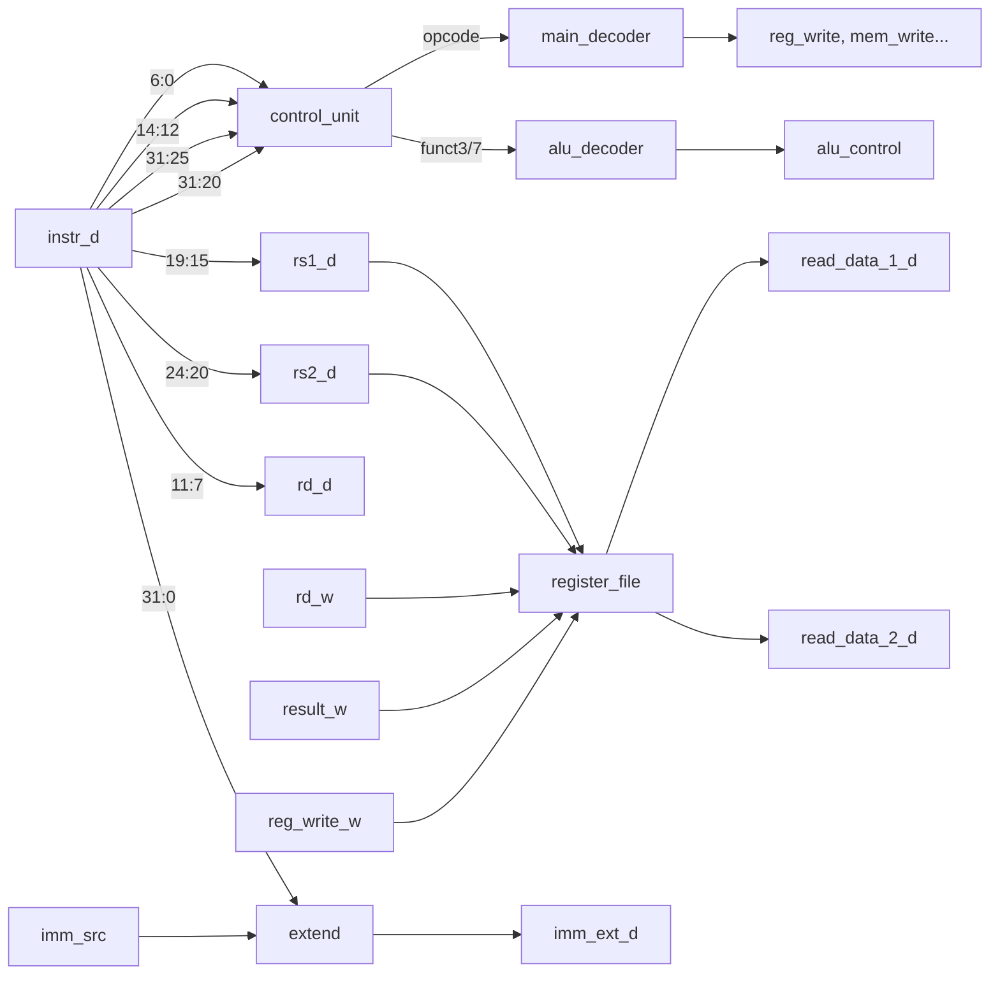
```mermaid
graph LR
    I[instr_d] -->|6:0| CU[control_unit]
    I -->|14:12| CU
    I -->|31:25| CU
    I -->|31:20| CU
    
    CU -->|opcode| MD[main_decoder]
    CU -->|funct3/7| AD[alu_decoder]
    
    MD --> CTRL[reg_write, mem_write... ]
    AD --> ALU_CTRL[alu_control]
    
    I -->|19:15| RS1[rs1_d]
    I -->|24:20| RS2[rs2_d]
    I -->|11:7| RD[rd_d]
    
    RS1 --> REG[register_file]
    RS2 --> REG
    
    RD_W[rd_w] --> REG
    RES_W[result_w] --> REG
    RW_W[reg_write_w] --> REG
    
    REG --> RD1[read_data_1_d]
    REG --> RD2[read_data_2_d]
    
    I -->|31:0| EXT[extend]
    IMM_SRC[imm_src] --> EXT
    EXT --> IMM[imm_ext_d]
```

---

## 4. Tầng Execute — `execute_cycle`

### Bảng tín hiệu

| Tên | Hướng | Rộng | Ý nghĩa |
|---|---|---|---|
| `forward_a_e` | Input | 2 | Forwarding cho src_a (00=reg, 01=WB, 10=MEM) |
| `forward_b_e` | Input | 2 | Forwarding cho src_b |
| `jump_e` | Input | 1 | Lệnh jump |
| `branch_e` | Input | 1 | Lệnh branch |
| `alu_src_e` | Input | 1 | 0=rs2, 1=immediate |
| `jalr_e` | Input | 1 | JALR |
| `funct3_e` | Input | 3 | funct3 (chọn điều kiện branch) |
| `alu_control_e` | Input | 4 | Mã lệnh ALU |
| `alu_result_m` | Input | 32 | Forwarding từ MEM stage |
| `read_data_1_e` | Input | 32 | rs1 từ pipeline reg D/E |
| `read_data_2_e` | Input | 32 | rs2 từ pipeline reg D/E |
| `imm_ext_e` | Input | 32 | Immediate |
| `pc_e` | Input | 32 | PC |
| `pc_plus_4_e` | Input | 32 | PC+4 |
| `result_w` | Input | 32 | Forwarding từ WB stage |
| `rd_e` | Input | 5 | Địa chỉ rd |
| `predict_taken_e` | Input | 1 | Dự đoán nhánh từ IF |
| `predict_target_e` | Input | 32 | Đích dự đoán từ IF |
| `pc_target_e` | Output | 32 | Địa chỉ đích branch/jump |
| `alu_result_e` | Output | 32 | Kết quả ALU |
| `write_data_e` | Output | 32 | Dữ liệu store (rs2 sau forwarding) |
| `pc_src_e` | Output | 1 | 1 = mispredict, cần thay đổi PC |
| `actual_taken_e` | Output | 1 | Thực tế branch/jump có nhảy không |
| `actual_target_e` | Output | 32 | Thực tế đích nhảy là đâu |
| `update_valid_e` | Output | 1 | Báo hiệu branch/jump hợp lệ để cập nhật Predictor |

### Nguyên lý hoạt động

```
src_a_e    = mux_3_1(read_data_1_e, result_w, alu_result_m, forward_a_e)
src_b_int  = mux_3_1(read_data_2_e, result_w, alu_result_m, forward_b_e)
src_b_e    = mux(src_b_int, imm_ext_e, alu_src_e)
alu_in_a   = (alu_control==AUIPC) ? pc_e : src_a_e
alu_result = ALU(alu_in_a, src_b_e, alu_control)

branch_taken = (BEQ: zero) | (BNE: ~zero) | (BLT: neg≠ov) | ...
pc_target  = jalr_e ? (alu_result & ~1) : (pc_e + imm_ext_e)

actual_taken_e = (branch_taken & branch_e) | jump_e
actual_target_e = pc_target

mispredict_e = (actual_taken_e != predict_taken_e) || 
               (actual_taken_e && (actual_target_e != predict_target_e))

pc_src_e = mispredict_e
update_valid_e = branch_e | jump_e
```

#### Sơ đồ logic tầng Execute

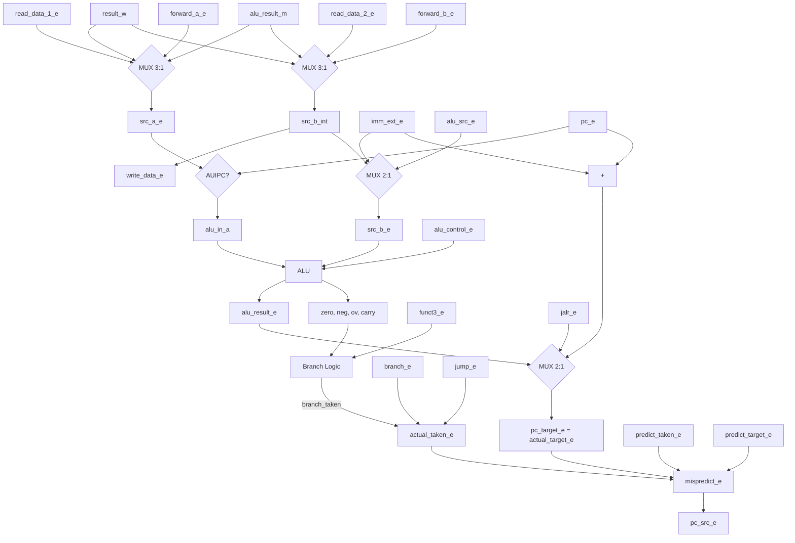
```mermaid
graph TD
    RD1[read_data_1_e] --> MUXA{MUX 3:1}
    RESW[result_w] --> MUXA
    ALUM[alu_result_m] --> MUXA
    FWDA[forward_a_e] --> MUXA
    MUXA --> SRCA[src_a_e]
    
    RD2[read_data_2_e] --> MUXB1{MUX 3:1}
    RESW --> MUXB1
    ALUM --> MUXB1
    FWDB[forward_b_e] --> MUXB1
    MUXB1 --> SRCB_INT[src_b_int]
    SRCB_INT --> WDATA[write_data_e]
    
    SRCB_INT --> MUXB2{MUX 2:1}
    IMM[imm_ext_e] --> MUXB2
    ALUSRC[alu_src_e] --> MUXB2
    MUXB2 --> SRCB[src_b_e]
    
    SRCA --> MUX_ALU{AUIPC?}
    PCE[pc_e] --> MUX_ALU
    MUX_ALU --> ALUA[alu_in_a]
    
    ALUA --> ALU[ALU]
    SRCB --> ALU
    ALU_CTRL[alu_control_e] --> ALU
    ALU --> ALURES[alu_result_e]
    ALU --> FLAGS[zero, neg, ov, carry]
    
    FLAGS --> BR_LOGIC[Branch Logic]
    F3[funct3_e] --> BR_LOGIC
    BR_LOGIC -->|branch_taken| ACT_TAKEN[actual_taken_e]
    BRE[branch_e] --> ACT_TAKEN
    JMPE[jump_e] --> ACT_TAKEN
    
    PCE --> ADD_TGT[+]
    IMM --> ADD_TGT
    ADD_TGT --> MUX_TGT{MUX 2:1}
    ALURES --> MUX_TGT
    JALRE[jalr_e] --> MUX_TGT
    MUX_TGT --> PCTGT[pc_target_e = actual_target_e]
    
    ACT_TAKEN --> MISP[mispredict_e]
    PCTGT --> MISP
    PRED_T[predict_taken_e] --> MISP
    PRED_TG[predict_target_e] --> MISP
    MISP --> PCSRC[pc_src_e]
```

---

## 5. Tầng Memory — `memory_cycle`

### Bảng tín hiệu

| Tên | Hướng | Rộng | Ý nghĩa |
|---|---|---|---|
| `clk` | Input | 1 | Clock (không dùng trong logic tổ hợp) |
| `rst` | Input | 1 | Reset |
| `mem_write_m` | Input | 1 | Enable store |
| `alu_result_m` | Input | 32 | Địa chỉ bộ nhớ |
| `write_data_m` | Input | 32 | Dữ liệu cần ghi (từ pipeline reg) |
| `funct3_m` | Input | 3 | Kiểu load/store (lb/lh/lw/lbu/lhu/sb/sh/sw) |
| `read_data_m_in` | Input | 32 | Dữ liệu đọc thô từ D-Cache |
| `read_data_m` | Output | 32 | Dữ liệu sau khi sign/zero-extend |
| `write_data_m_out` | Output | 32 | Dữ liệu store sau khi căn chỉnh byte |

### Nguyên lý hoạt động

Module thực hiện **căn chỉnh dữ liệu** cho sub-word access:

**Store alignment** (`write_data_m_out`):
```
byte_offset = alu_result_m[1:0]
shift_amt   = {byte_offset, 3'b000}   // 0, 8, 16, 24 bit
sb/sh: write_data << shift_amt
sw:    write_data (không dịch)
```

**Load sign/zero-extend** (`read_data_m`):
```
shifted = read_data_m_in >> shift_amt
lb:  sign-extend 8 bit
lh:  sign-extend 16 bit
lw:  giữ nguyên 32 bit
lbu: zero-extend 8 bit
lhu: zero-extend 16 bit
```

#### Sơ đồ logic tầng Memory

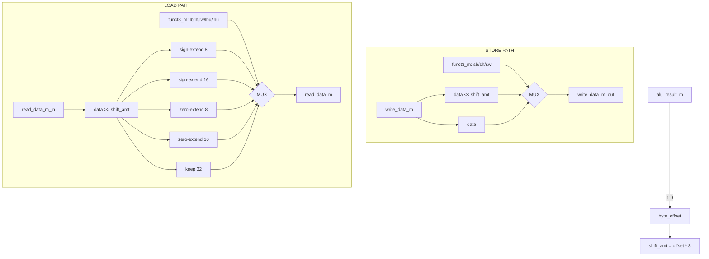
```mermaid
graph TD
    ALURES[alu_result_m] -->|1:0| OFFSET[byte_offset]
    OFFSET --> SHAMT[shift_amt = offset * 8]
    
    subgraph STORE PATH
        WDATA[write_data_m] --> SLL[data << shift_amt]
        WDATA --> NOP[data]
        F3S[funct3_m: sb/sh/sw] --> MUX_S{MUX}
        SLL --> MUX_S
        NOP --> MUX_S
        MUX_S --> WOUT[write_data_m_out]
    end
    
    subgraph LOAD PATH
        RDATA[read_data_m_in] --> SRL[data >> shift_amt]
        SRL --> EXT8S[sign-extend 8]
        SRL --> EXT16S[sign-extend 16]
        SRL --> EXT8U[zero-extend 8]
        SRL --> EXT16U[zero-extend 16]
        SRL --> EXT32[keep 32]
        
        F3L[funct3_m: lb/lh/lw/lbu/lhu] --> MUX_L{MUX}
        EXT8S --> MUX_L
        EXT16S --> MUX_L
        EXT8U --> MUX_L
        EXT16U --> MUX_L
        EXT32 --> MUX_L
        MUX_L --> ROUT[read_data_m]
    end
```

---

## 6. Tầng Writeback — `writeback_cycle`

### Bảng tín hiệu

| Tên | Hướng | Rộng | Ý nghĩa |
|---|---|---|---|
| `result_src_w` | Input | 3 | Chọn nguồn kết quả |
| `alu_result_w` | Input | 32 | Kết quả ALU |
| `read_data_w` | Input | 32 | Dữ liệu từ bộ nhớ (load) |
| `pc_plus_4_w` | Input | 32 | PC+4 (dùng cho JAL/JALR) |
| `csr_rd_w` | Input | 32 | Dữ liệu đọc từ CSR |
| `result_w` | Output | 32 | Dữ liệu ghi vào thanh ghi |

### Nguyên lý hoạt động

```
result_w = mux_4to1(alu_result_w, read_data_w, pc_plus_4_w, csr_rd_w, result_src_w)
  00 → ALU result (R-type, I-type ALU, LUI, AUIPC)
  01 → Memory (load)
  10 → PC+4 (JAL/JALR)
  11 → CSR (csrrw/csrrs/csrrc)
```

#### Sơ đồ logic tầng Writeback

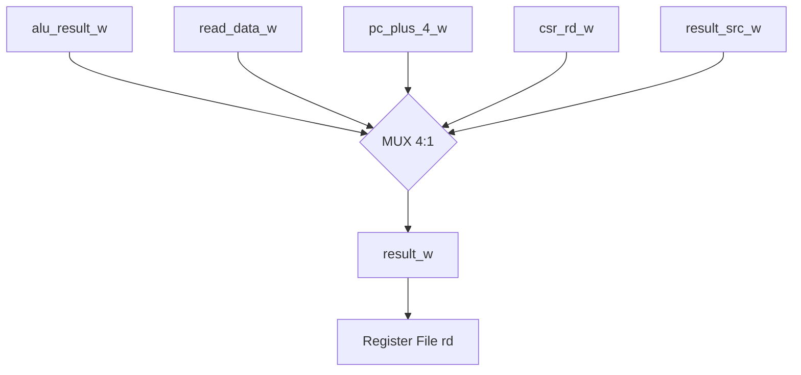
```mermaid
graph TD
    ALURES[alu_result_w] --> MUX{MUX 4:1}
    RDATA[read_data_w] --> MUX
    PC4[pc_plus_4_w] --> MUX
    CSR[csr_rd_w] --> MUX
    
    RSRC[result_src_w] --> MUX
    MUX --> RES[result_w]
    RES --> REG[Register File rd]
```

---

## 7. Các thanh ghi Pipeline

### `pipeline_1_2` (Fetch → Decode)

| Tên | Hướng | Rộng | Ý nghĩa |
|---|---|---|---|
| `clk, rst` | Input | 1 | Clock, reset |
| `clr` | Input | 1 | Flush (= `flush_d`) |
| `en` | Input | 1 | Enable (= `~stall_d`) |
| `instr_f, pc_f, pc_plus_4_f` | Input | 32 | Dữ liệu từ tầng IF |
| `instr_d, pc_d, pc_plus_4_d` | Output | 32 | Dữ liệu sang tầng ID |

Khi `clr=1`: ghi `NOP (0x00000000)`. Khi `en=0`: giữ nguyên (stall).

### `pipeline_2_3` (Decode → Execute)

Truyền toàn bộ tín hiệu điều khiển + dữ liệu từ Decode sang Execute, bao gồm thêm: `csr_we`, `csr_addr`, `csr_rd`. Flush khi `flush_e=1`.

### `pipeline_3_4` (Execute → Memory)

Truyền: `reg_write`, `mem_write`, `result_src`, `alu_result`, `write_data`, `pc_plus_4`, `rd`, `funct3`, `csr_we/addr/rd/wd`.

### `pipeline_4_5` (Memory → Writeback)

Truyền: `reg_write`, `result_src`, `alu_result`, `read_data`, `pc_plus_4`, `rd`, `csr_we/addr/rd/wd`.

#### Sơ đồ hoạt động Pipeline Register (chung)

```
         clr (flush)    en (stall)
              │               │
              ▼               ▼
    ┌─────────────────────────────────────────┐
    │         PIPELINE REGISTER               │
    │                                         │
    │   posedge clk:                          │
    │   ┌─ if (!rst || clr)                   │
    │   │   reg ← 0 (NOP / bubble)            │
    │   └─ else if (en)                       │
    │       reg ← input_data                  │
    │       (khi stall: giữ nguyên)           │
    └─────────────────────────────────────────┘

 clr=1  → Flush:  chèn NOP vào tầng tiếp theo
 en=0   → Stall:  giữ nguyên giá trị (đóng băng tầng)
 en=1, clr=0 → Normal: cập nhật giá trị mới
```

---

## 8. Đơn vị điều khiển — `control_unit`

### Bảng tín hiệu

| Tên | Hướng | Rộng | Ý nghĩa |
|---|---|---|---|
| `op` | Input | 7 | Opcode (instr[6:0]) |
| `funct7` | Input | 7 | funct7 (instr[31:25]) |
| `funct3` | Input | 3 | funct3 (instr[14:12]) |
| `imm12` | Input | 12 | instr[31:20] (dùng phân biệt ECALL/MRET) |
| `reg_write` | Output | 1 | Enable ghi thanh ghi |
| `mem_write` | Output | 1 | Enable ghi bộ nhớ |
| `alu_src` | Output | 1 | 0=rs2, 1=immediate |
| `jump` | Output | 1 | JAL/JALR |
| `branch` | Output | 1 | Branch |
| `jalr` | Output | 1 | JALR |
| `result_src` | Output | 3 | Nguồn WB |
| `imm_src` | Output | 3 | Kiểu immediate |
| `alu_control` | Output | 4 | Mã ALU |
| `csr_we` | Output | 1 | Ghi CSR |
| `is_ecall` | Output | 1 | ECALL |
| `is_mret` | Output | 1 | MRET |

### Nguyên lý hoạt động

- Phát hiện **ECALL**: `opcode=1110011`, `funct3=000`, `imm12=0x000`
- Phát hiện **MRET**: `opcode=1110011`, `funct3=000`, `imm12=0x302`
- **CSR write enable**: `opcode=1110011` và `funct3≠000`
- Khi ECALL/MRET: `reg_write=0` (ngăn ghi thanh ghi)
- Dùng `funct3_modified` để phân biệt LUI (`001`) và AUIPC (`000`) cho ALU decoder

#### Sơ đồ logic control_unit

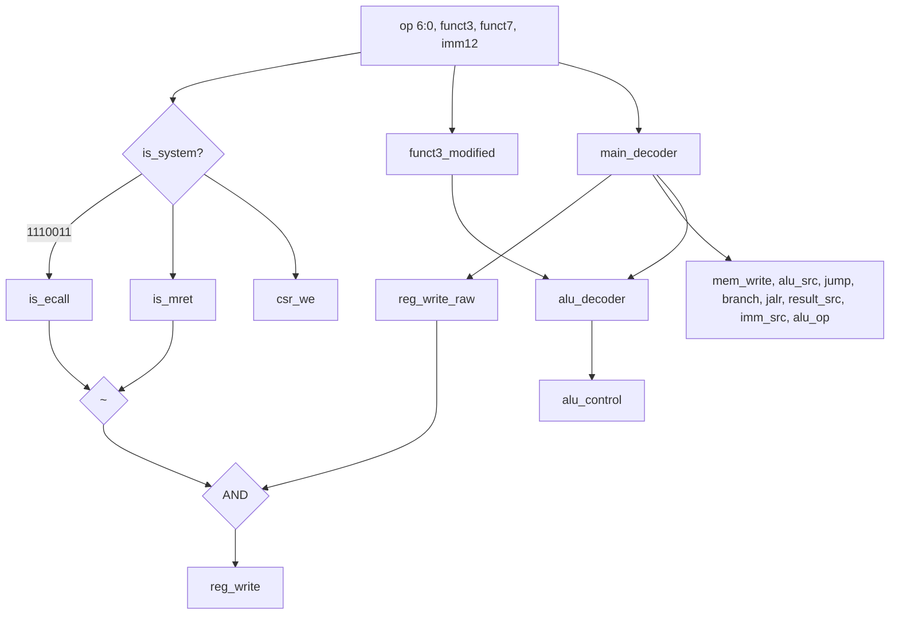
```mermaid
graph TD
    OP[op 6:0, funct3, funct7, imm12] --> SYS{is_system?}
    SYS -->|1110011| ECALL[is_ecall]
    SYS --> MRET[is_mret]
    SYS --> CSRWE[csr_we]
    
    OP --> MOD_F3[funct3_modified]
    
    OP --> MD[main_decoder]
    MD --> RW_RAW[reg_write_raw]
    MD --> MW[mem_write, alu_src, jump, branch, jalr, result_src, imm_src, alu_op]
    
    MD --> AD[alu_decoder]
    MOD_F3 --> AD
    AD --> ACTRL[alu_control]
    
    RW_RAW --> AND1{AND}
    ECALL --> NOT1{~}
    MRET --> NOT1
    NOT1 --> AND1
    AND1 --> RW[reg_write]
```

---

## 9. Main Decoder — `main_decoder`

### Bảng tín hiệu

| Tên | Hướng | Rộng | Ý nghĩa |
|---|---|---|---|
| `op` | Input | 7 | Opcode |
| `reg_write` | Output | 1 | Ghi thanh ghi |
| `alu_op` | Output | 2 | `00`=ADD, `01`=SUB(branch), `10`=funct3/7, `11`=upper-imm |
| `imm_src` | Output | 3 | `000`=I, `001`=S, `010`=B, `011`=J, `100`=CSR |
| `mem_write` | Output | 1 | Store |
| `alu_src` | Output | 1 | Nguồn ALU B |
| `result_src` | Output | 3 | Nguồn WB |
| `branch` | Output | 1 | Branch |
| `jump` | Output | 1 | Jump |
| `jalr` | Output | 1 | JALR |

### Bảng giải mã Opcode → Tín hiệu

| Lệnh | Opcode | reg_write | alu_src | mem_write | result_src | alu_op | imm_src |
|---|---|---|---|---|---|---|---|
| R-type | 0110011 | 1 | 0 | 0 | 00 | 10 | - |
| I-ALU | 0010011 | 1 | 1 | 0 | 00 | 10 | 000 |
| Load | 0000011 | 1 | 1 | 0 | 01 | 00 | 000 |
| Store | 0100011 | 0 | 1 | 1 | - | 00 | 001 |
| Branch | 1100011 | 0 | 0 | 0 | - | 01 | 010 |
| JAL | 1101111 | 1 | - | 0 | 10 | 00 | 011 |
| JALR | 1100111 | 1 | 1 | 0 | 10 | 00 | 000 |
| LUI | 0110111 | 1 | 1 | 0 | 00 | 11 | 000 |
| AUIPC | 0010111 | 1 | 1 | 0 | 00 | 11 | 000 |
| CSR | 1110011 | 1* | - | 0 | 11 | - | 100 |

*`reg_write` cho CSR bị override bởi `control_unit` khi ECALL/MRET.

#### Sơ đồ logic main_decoder

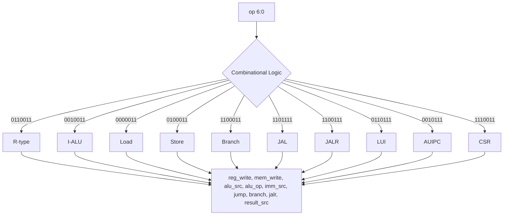
```mermaid
graph TD
    OP[op 6:0] --> LOGIC{Combinational Logic}
    LOGIC -->|0110011| R[R-type]
    LOGIC -->|0010011| I[I-ALU]
    LOGIC -->|0000011| L[Load]
    LOGIC -->|0100011| S[Store]
    LOGIC -->|1100011| B[Branch]
    LOGIC -->|1101111| JAL[JAL]
    LOGIC -->|1100111| JALR[JALR]
    LOGIC -->|0110111| LUI[LUI]
    LOGIC -->|0010111| AUIPC[AUIPC]
    LOGIC -->|1110011| CSR[CSR]
    
    R --> OUT[reg_write, mem_write, alu_src, alu_op, imm_src, jump, branch, jalr, result_src]
    I --> OUT
    L --> OUT
    S --> OUT
    B --> OUT
    JAL --> OUT
    JALR --> OUT
    LUI --> OUT
    AUIPC --> OUT
    CSR --> OUT
```

---

## 10. ALU Decoder — `alu_decoder`

### Bảng tín hiệu

| Tên | Hướng | Rộng | Ý nghĩa |
|---|---|---|---|
| `alu_op` | Input | 2 | Từ main_decoder |
| `funct3` | Input | 3 | funct3 (có thể bị modify cho LUI/AUIPC) |
| `funct7` | Input | 7 | funct7 |
| `op` | Input | 7 | Opcode (phân biệt R/I-type ADD vs SUB) |
| `alu_control` | Output | 4 | Mã điều khiển ALU |

### Bảng mã `alu_control`

| Mã | Phép tính | Lệnh |
|---|---|---|
| 0000 | ADD | add, addi, lw, sw, jal, jalr |
| 0001 | SUB | sub, branch comparison |
| 0010 | AND | and, andi |
| 0011 | OR | or, ori |
| 0100 | XOR | xor, xori |
| 0101 | SLT | slt, slti |
| 0110 | SLTU | sltu, sltiu |
| 1000 | AUIPC | PC + (imm<<12) |
| 1001 | LUI | pass immediate |
| 1010 | SLL | sll, slli |
| 1011 | SRA | sra, srai |
| 1100 | SRL | srl, srli |

#### Sơ đồ logic alu_decoder

```
  alu_op[1:0]
       │
       ├── 00 ──────────────────────────────────────▶ 0000 (ADD)  [Load/Store]
       │
       ├── 01 ──────────────────────────────────────▶ 0001 (SUB)  [Branch compare]
       │
       ├── 10 ──▶ funct3[2:0]
       │               │
       │         ├─ 000 ──▶ {op[5], funct7[5]}
       │         │               ├─ 11 → 0001 (SUB)   [R-type SUB]
       │         │               └─ else→ 0000 (ADD)  [ADD/ADDI]
       │         ├─ 001 ──────────────────────────────▶ 1010 (SLL)
       │         ├─ 010 ──────────────────────────────▶ 0101 (SLT)
       │         ├─ 011 ──────────────────────────────▶ 0110 (SLTU)
       │         ├─ 100 ──────────────────────────────▶ 0100 (XOR)
       │         ├─ 101 ──▶ funct7[5]
       │         │               ├─ 1 → 1011 (SRA)
       │         │               └─ 0 → 1100 (SRL)
       │         ├─ 110 ──────────────────────────────▶ 0011 (OR)
       │         └─ 111 ──────────────────────────────▶ 0010 (AND)
       │
       └── 11 ──▶ funct3[2:0] (LUI/AUIPC modified)
                      ├─ 000 (AUIPC) ──────────────────▶ 1000
                      └─ 001 (LUI)   ──────────────────▶ 1001
```

---

## 11. ALU — `alu`

### Bảng tín hiệu

| Tên | Hướng | Rộng | Ý nghĩa |
|---|---|---|---|
| `a` | Input | 32 | Toán hạng A |
| `b` | Input | 32 | Toán hạng B |
| `alu_control` | Input | 4 | Mã lệnh |
| `overflow` | Output | 1 | Tràn số (ADD/SUB có dấu) |
| `carry` | Output | 1 | Carry out (ADD/SUB) |
| `neg` | Output | 1 | Bit dấu của kết quả |
| `zero` | Output | 1 | Kết quả = 0 (dùng cho BEQ) |
| `result` | Output | 32 | Kết quả phép tính |

### Nguyên lý hoạt động

Dùng shared adder: `b_inv = (alu_control[0]) ? ~b : b`, `sum = a + b_inv + alu_control[0]`. Phép SUB là ADD với bù hai. Các cờ `zero`, `neg`, `overflow` dùng cho branch condition:

| Branch | Điều kiện |
|---|---|
| BEQ | `zero` |
| BNE | `~zero` |
| BLT | `neg ≠ overflow` |
| BGE | `neg == overflow` |
| BLTU | `~carry` |
| BGEU | `carry` |

#### Sơ đồ logic ALU

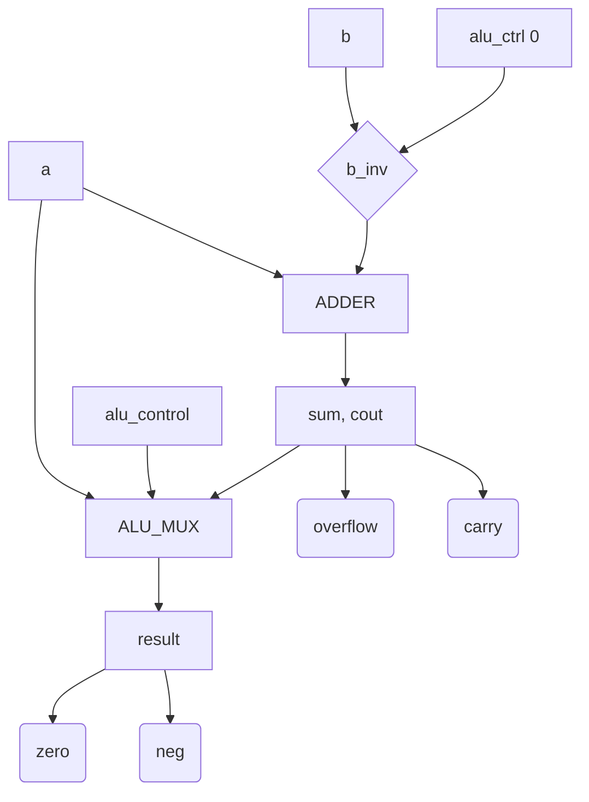
```mermaid
graph TD
    A[a] --> ALU_MUX
    B[b] --> B_INV{b_inv}
    CTRL0[alu_ctrl 0] --> B_INV
    B_INV --> ADDER
    A --> ADDER
    ADDER --> SUM[sum, cout]
    SUM --> ALU_MUX
    
    ALU_CTRL[alu_control] --> ALU_MUX
    
    ALU_MUX --> RES[result]
    
    RES --> ZERO(zero)
    RES --> NEG(neg)
    SUM --> OVERFLOW(overflow)
    SUM --> CARRY(carry)
```

---

## 12. Register File — `register_file`

### Bảng tín hiệu

| Tên | Hướng | Rộng | Ý nghĩa |
|---|---|---|---|
| `clk` | Input | 1 | Clock |
| `rst` | Input | 1 | Reset |
| `write_en_3` | Input | 1 | Enable ghi |
| `addr_1` | Input | 5 | Địa chỉ đọc rs1 |
| `addr_2` | Input | 5 | Địa chỉ đọc rs2 |
| `addr_3` | Input | 5 | Địa chỉ ghi rd |
| `write_data_3` | Input | 32 | Dữ liệu ghi |
| `read_data_1` | Output | 32 | Dữ liệu rs1 |
| `read_data_2` | Output | 32 | Dữ liệu rs2 |

### Nguyên lý hoạt động

- **Ghi đồng bộ** (posedge clk): ghi khi `write_en_3=1` và `addr_3≠0`
- **Đọc tổ hợp + bypassing nội bộ**: nếu đang đọc cùng địa chỉ đang ghi → trả về `write_data_3` ngay lập tức (tránh hazard 1 cycle trong WB/ID)
- `x0` luôn trả về `32'h0` dù có ghi

#### Sơ đồ logic Register File

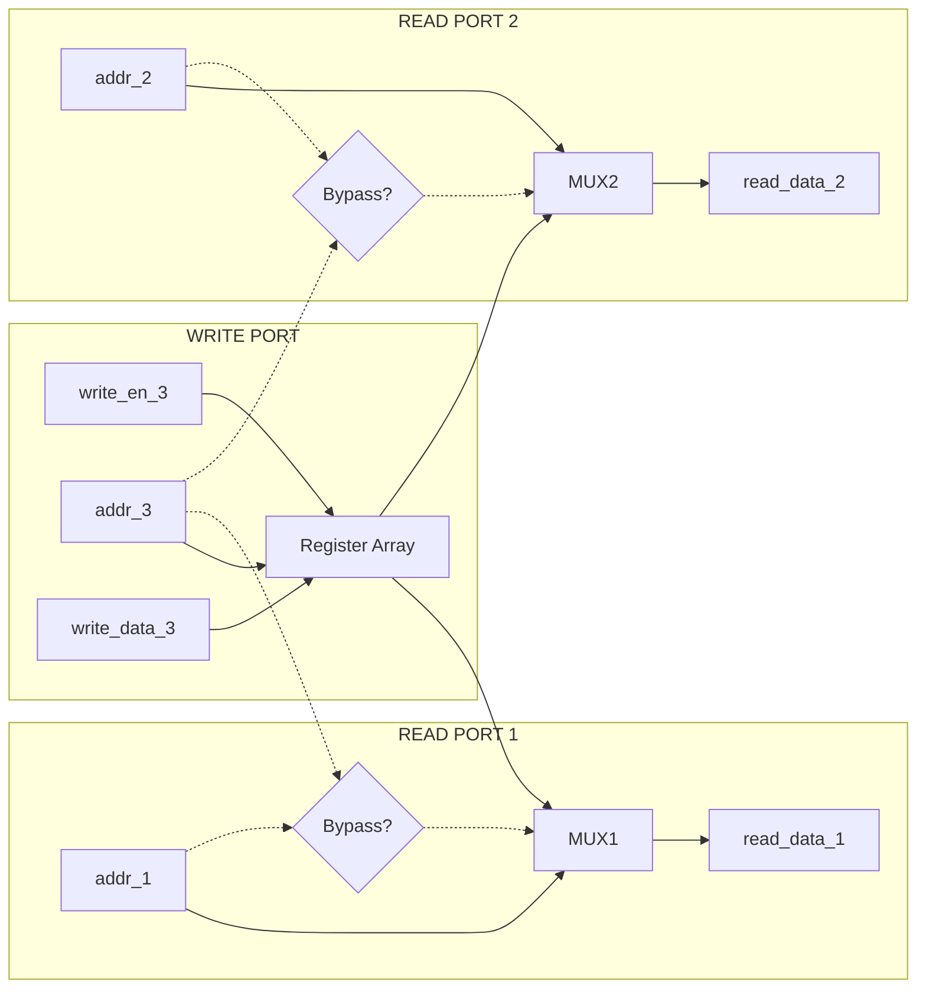
```mermaid
graph LR
    subgraph WRITE PORT
        WE[write_en_3] --> REG_ARRAY
        A3[addr_3] --> REG_ARRAY
        WD3[write_data_3] --> REG_ARRAY
    end
    
    REG_ARRAY[Register Array] --> MUX1
    REG_ARRAY --> MUX2
    
    subgraph READ PORT 1
        A1[addr_1] --> MUX1
        MUX1 --> RD1[read_data_1]
        A1 -.-> BYPASS1{Bypass?}
        A3 -.-> BYPASS1
        BYPASS1 -.-> MUX1
    end
    
    subgraph READ PORT 2
        A2[addr_2] --> MUX2
        MUX2 --> RD2[read_data_2]
        A2 -.-> BYPASS2{Bypass?}
        A3 -.-> BYPASS2
        BYPASS2 -.-> MUX2
    end
```

---

## 13. Extend — `extend`

### Bảng tín hiệu

| Tên | Hướng | Rộng | Ý nghĩa |
|---|---|---|---|
| `instr` | Input | 32 | Lệnh 32-bit |
| `imm_src` | Input | 3 | Kiểu mở rộng |
| `imm_ext` | Output | 32 | Immediate mở rộng |

### Bảng kiểu mở rộng

| `imm_src` | Kiểu | Bits lấy | Ghi chú |
|---|---|---|---|
| 000 | I-type / U-type | instr[31:20] (I), instr[31:12]<<12 (LUI/AUIPC) | Tự phát hiện qua opcode |
| 001 | S-type | {instr[31:25], instr[11:7]} | Store |
| 010 | B-type | {instr[31], instr[7], instr[30:25], instr[11:8], 1'b0} | Branch |
| 011 | J-type | {instr[31], instr[19:12], instr[20], instr[30:21], 1'b0} | JAL |
| 100 | CSR | {27'b0, instr[19:15]} | Zero-extend rs1/zimm |

#### Sơ đồ trích xuất immediate

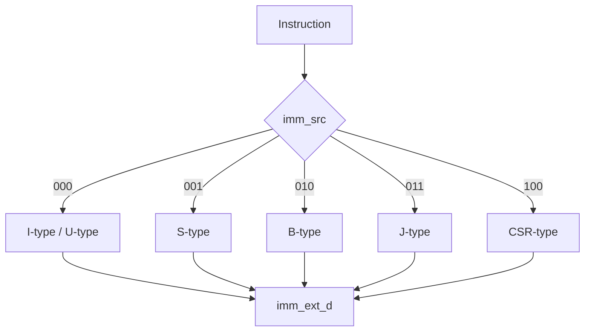
```mermaid
graph TD
    INSTR[Instruction] --> IMM_LOGIC{imm_src}
    IMM_LOGIC -->|000| I_TYPE[I-type / U-type]
    IMM_LOGIC -->|001| S_TYPE[S-type]
    IMM_LOGIC -->|010| B_TYPE[B-type]
    IMM_LOGIC -->|011| J_TYPE[J-type]
    IMM_LOGIC -->|100| CSR_TYPE[CSR-type]
    
    I_TYPE --> EXT[imm_ext_d]
    S_TYPE --> EXT
    B_TYPE --> EXT
    J_TYPE --> EXT
    CSR_TYPE --> EXT
```

---

## 14. Program Counter — `pc`

### Bảng tín hiệu

| Tên | Hướng | Rộng | Ý nghĩa |
|---|---|---|---|
| `clk` | Input | 1 | Clock |
| `rst` | Input | 1 | Reset tích cực thấp |
| `en` | Input | 1 | Enable cập nhật |
| `pc_next` | Input | 32 | Giá trị PC tiếp theo |
| `pc` | Output | 32 | PC hiện tại |

Khi `rst=0`: `pc ← 0`. Khi `en=1`: `pc ← pc_next`. Khi `en=0`: giữ nguyên.

#### Sơ đồ logic PC

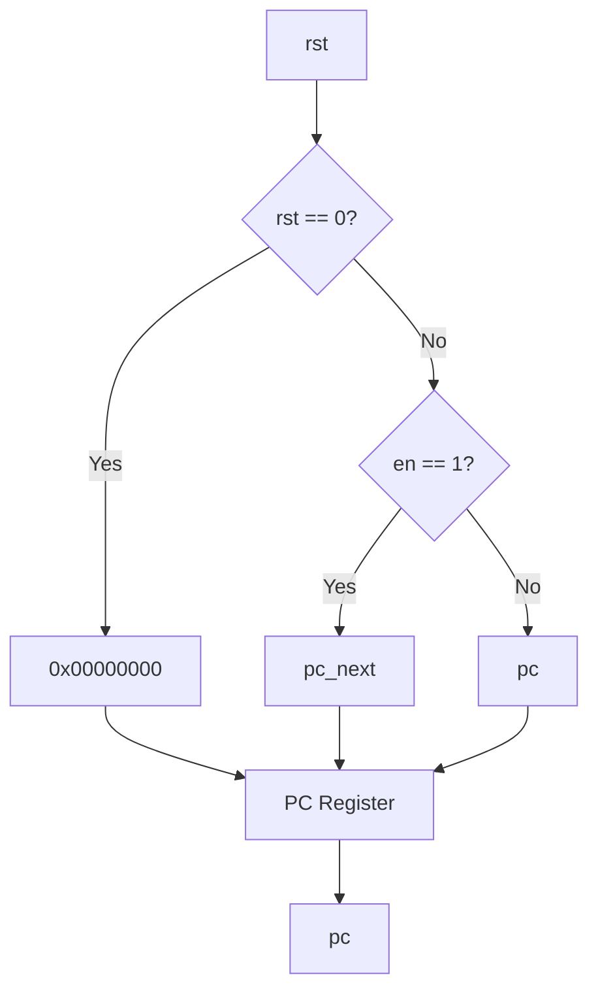
```mermaid
graph TD
    RST[rst] --> MUX_RST{rst == 0?}
    MUX_RST -->|Yes| ZERO[0x00000000]
    MUX_RST -->|No| EN_CHECK{en == 1?}
    EN_CHECK -->|Yes| NEXT[pc_next]
    EN_CHECK -->|No| CURR[pc]
    
    ZERO --> PC_REG
    NEXT --> PC_REG
    CURR --> PC_REG
    
    PC_REG[PC Register] --> PC_OUT[pc]
```

---

## 15. Hazard Unit — `hazard_unit`

### Bảng tín hiệu

| Tên | Hướng | Rộng | Ý nghĩa |
|---|---|---|---|
| `rst` | Input | 1 | Reset |
| `reg_write_m` | Input | 1 | MEM stage có ghi thanh ghi |
| `reg_write_w` | Input | 1 | WB stage có ghi thanh ghi |
| `pc_src_e` | Input | 1 | Branch/jump taken |
| `rd_m` | Input | 5 | Rd của lệnh ở MEM |
| `rd_w` | Input | 5 | Rd của lệnh ở WB |
| `rs1_e, rs2_e` | Input | 5 | Rs của lệnh ở EX |
| `rd_e` | Input | 5 | Rd của lệnh ở EX |
| `rs1_d, rs2_d` | Input | 5 | Rs của lệnh ở ID |
| `result_src_e` | Input | 3 | Kiểu lệnh ở EX (bit[0]=1: load) |
| `icache_stall` | Input | 1 | I-Cache đang fetch |
| `dcache_stall` | Input | 1 | D-Cache đang fetch/evict |
| `forward_a_e` | Output | 2 | Forwarding MUX cho src_a |
| `forward_b_e` | Output | 2 | Forwarding MUX cho src_b |
| `stall_f/d/e/m/w` | Output | 1×5 | Stall từng tầng |
| `flush_e` | Output | 1 | Flush tầng Execute |
| `flush_d` | Output | 1 | Flush tầng Decode |

### Nguyên lý hoạt động

**Forwarding** (ưu tiên MEM > WB):
```
forward_a_e = 10 nếu (rs1_e==rd_m) && reg_write_m && rs1_e≠0  ← từ MEM
            = 01 nếu (rs1_e==rd_w) && reg_write_w && rs1_e≠0  ← từ WB
            = 00  ← không forward
```

**Load-Use Stall**:
```
stall = result_src_e[0] && rd_e≠0 && (rs1_d==rd_e || rs2_d==rd_e)
→ stall_f=1, stall_d=1 (đóng băng IF và ID)
→ flush_e=1 (chèn bubble vào EX)
```

**Stall ưu tiên**:
```
dcache_stall → stall tất cả 5 tầng (hệ thống đóng băng hoàn toàn)
icache_stall → stall IF và ID (EX/MEM/WB tiếp tục chạy)
load-use     → stall IF và ID, flush EX
branch/jump  → flush_d=1, flush_e=1 (loại bỏ 2 lệnh sai)
```

#### Sơ đồ logic Hazard Unit

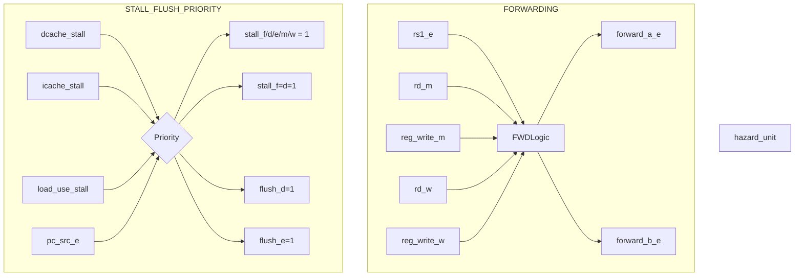
```mermaid
graph TD
    HU[hazard_unit]
    
    subgraph FORWARDING
        RS1E[rs1_e] --> FWDLogic
        RDM[rd_m] --> FWDLogic
        RWM[reg_write_m] --> FWDLogic
        RDW[rd_w] --> FWDLogic
        RWW[reg_write_w] --> FWDLogic
        FWDLogic --> FWDA[forward_a_e]
        FWDLogic --> FWDB[forward_b_e]
    end
    
    subgraph STALL_FLUSH_PRIORITY
        DC[dcache_stall] --> PRIO{Priority}
        IC[icache_stall] --> PRIO
        LU[load_use_stall] --> PRIO
        PCSRC[pc_src_e] --> PRIO
        
        PRIO --> STALL_ALL[stall_f/d/e/m/w = 1]
        PRIO --> STALL_FD[stall_f=d=1]
        PRIO --> FLUSHD[flush_d=1]
        PRIO --> FLUSHE[flush_e=1]
    end
```

---

## 16. CSR File — `csr_file`

### Bảng tín hiệu

| Tên | Hướng | Rộng | Ý nghĩa |
|---|---|---|---|
| `clk` | Input | 1 | Clock |
| `rst` | Input | 1 | Reset |
| `csr_raddr` | Input | 12 | Địa chỉ đọc CSR (từ Decode) |
| `csr_waddr` | Input | 12 | Địa chỉ ghi CSR (từ WB) |
| `csr_we` | Input | 1 | Enable ghi CSR |
| `csr_wd` | Input | 32 | Dữ liệu ghi CSR |
| `csr_rd` | Output | 32 | Dữ liệu đọc CSR |
| `is_exception` | Input | 1 | ECALL xảy ra |
| `pc` | Input | 32 | PC của lệnh gây exception |
| `cause` | Input | 32 | Mã nguyên nhân exception (=11 cho ecall M-mode) |
| `epc` | Output | 32 | mepc → PC mux (dùng cho MRET) |
| `trap_vec` | Output | 32 | mtvec → PC mux (dùng cho ECALL) |

### CSR được hỗ trợ

| Địa chỉ | Tên | Ý nghĩa |
|---|---|---|
| 0x300 | mstatus | Machine status register |
| 0x305 | mtvec | Trap handler base address |
| 0x340 | mscratch | Scratch register |
| 0x341 | mepc | Machine exception PC |
| 0x342 | mcause | Exception cause code |

**Internal bypassing**: Nếu `csr_raddr == csr_waddr` và `csr_we=1`, trả về `csr_wd` ngay (tránh hazard đọc-ghi CSR).

**Hardware auto-update** (ưu tiên cao hơn CSR instruction): Khi `is_exception=1`:
```
mepc   ← pc      // lưu PC lệnh ECALL
mcause ← cause   // lưu mã lỗi (= 11)
```

#### Sơ đồ logic CSR File

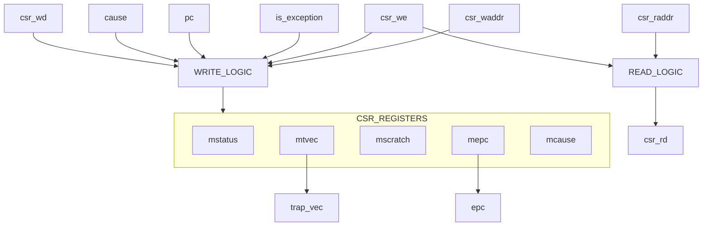
```mermaid
graph TD
    RADDR[csr_raddr] --> READ_LOGIC
    WADDR[csr_waddr] --> WRITE_LOGIC
    WE[csr_we] --> READ_LOGIC
    WE --> WRITE_LOGIC
    
    subgraph CSR_REGISTERS
        MSTATUS[mstatus]
        MTVEC[mtvec]
        MSCRATCH[mscratch]
        MEPC[mepc]
        MCAUSE[mcause]
    end
    
    READ_LOGIC --> CSR_RD[csr_rd]
    
    EXC[is_exception] --> WRITE_LOGIC
    PC[pc] --> WRITE_LOGIC
    CAUSE[cause] --> WRITE_LOGIC
    WD[csr_wd] --> WRITE_LOGIC
    
    WRITE_LOGIC --> CSR_REGISTERS
    
    MEPC --> EPC_OUT[epc]
    MTVEC --> TVEC_OUT[trap_vec]
```

---

## 17. CSR ALU — `csr_alu`

### Bảng tín hiệu

| Tên | Hướng | Rộng | Ý nghĩa |
|---|---|---|---|
| `funct3` | Input | 3 | Kiểu lệnh CSR |
| `src_a` | Input | 32 | Giá trị rs1 (sau forwarding) |
| `imm_ext` | Input | 32 | Zero-extended zimm (rs1 field) |
| `csr_rd` | Input | 32 | Giá trị hiện tại của CSR |
| `csr_wd` | Output | 32 | Giá trị mới ghi vào CSR |

| funct3[1:0] | Kiểu | Công thức |
|---|---|---|
| 01 | CSRRW / CSRRWI | `csr_wd = operand` (ghi đè) |
| 10 | CSRRS / CSRRSI | `csr_wd = csr_rd | operand` (set bit) |
| 11 | CSRRC / CSRRCI | `csr_wd = csr_rd & ~operand` (clear bit) |

`funct3[2]=1` → dùng `imm_ext` (zimm). `funct3[2]=0` → dùng `src_a` (rs1).

#### Sơ đồ logic CSR ALU

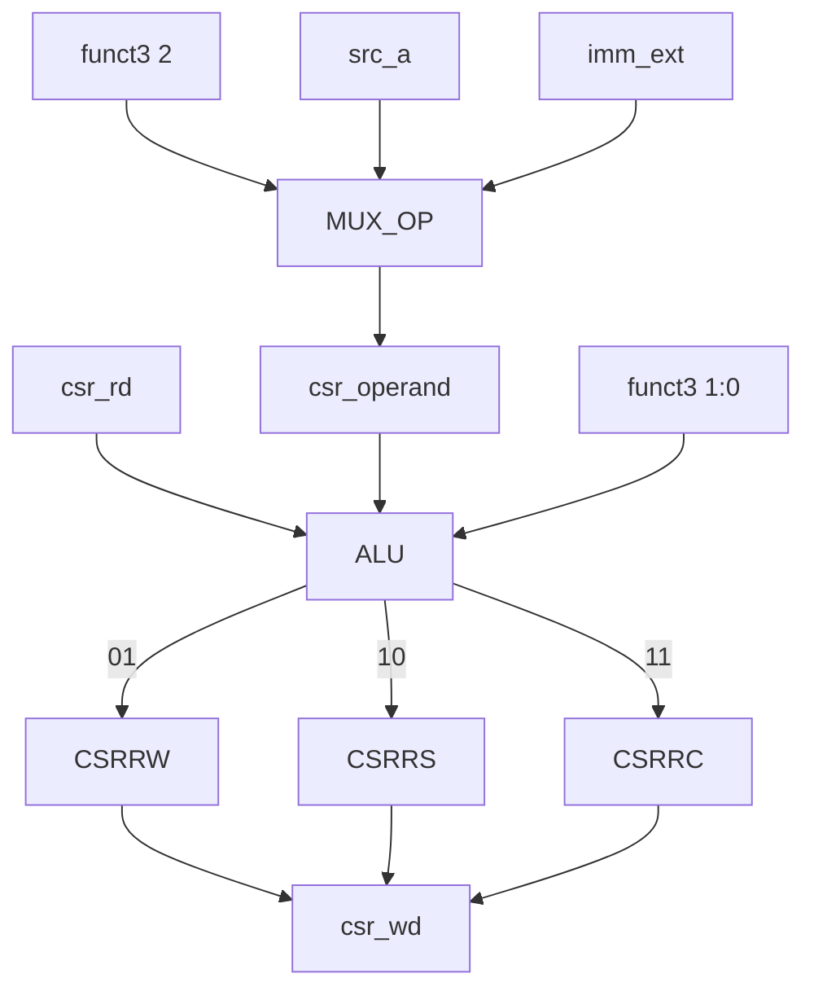
```mermaid
graph TD
    F3[funct3 2] --> MUX_OP
    SRCA[src_a] --> MUX_OP
    IMM[imm_ext] --> MUX_OP
    MUX_OP --> OP[csr_operand]
    
    RD[csr_rd] --> ALU
    OP --> ALU
    
    F3_10[funct3 1:0] --> ALU
    ALU -->|01| RW[CSRRW]
    ALU -->|10| RS[CSRRS]
    ALU -->|11| RC[CSRRC]
    
    RW --> WD[csr_wd]
    RS --> WD
    RC --> WD
```

---

## 18. L1 I-Cache — `l1_icache`

### Bảng tín hiệu

| Tên | Hướng | Rộng | Ý nghĩa |
|---|---|---|---|
| `clk, rst_n` | Input | 1 | Clock, reset tích cực thấp |
| `cpu_addr` | Input | 32 | Địa chỉ PC cần nạp |
| `cpu_rdata` | Output | 32 | Lệnh trả về cho CPU |
| `icache_stall` | Output | 1 | 1 = đang miss, stall pipeline |
| `m_axi_ar*` | Output | - | AXI4-Lite AR channel (gửi địa chỉ đọc) |
| `m_axi_r*` | Input | - | AXI4-Lite R channel (nhận dữ liệu) |

### Cấu trúc cache

- **16 line, direct-mapped** (index = addr[5:2], tag = addr[31:6])
- **Read-only** (không có dirty bit)
- **3 trạng thái FSM**: IDLE → AR_WAIT → R_WAIT → IDLE

### Nguyên lý hoạt động

- **Hit**: `hit = cache_valid[index] && (cache_tag[index] == tag)` → trả về `cache_data[index]`, không stall
- **Miss**: `icache_stall=1`, chuyển sang AR_WAIT (gửi địa chỉ qua AXI), rồi R_WAIT (chờ dữ liệu), cập nhật cache, về IDLE
- Khi stall, Hazard Unit giữ nguyên IF và ID, EX/MEM/WB tiếp tục chạy

#### Sơ đồ cấu trúc và FSM I-Cache

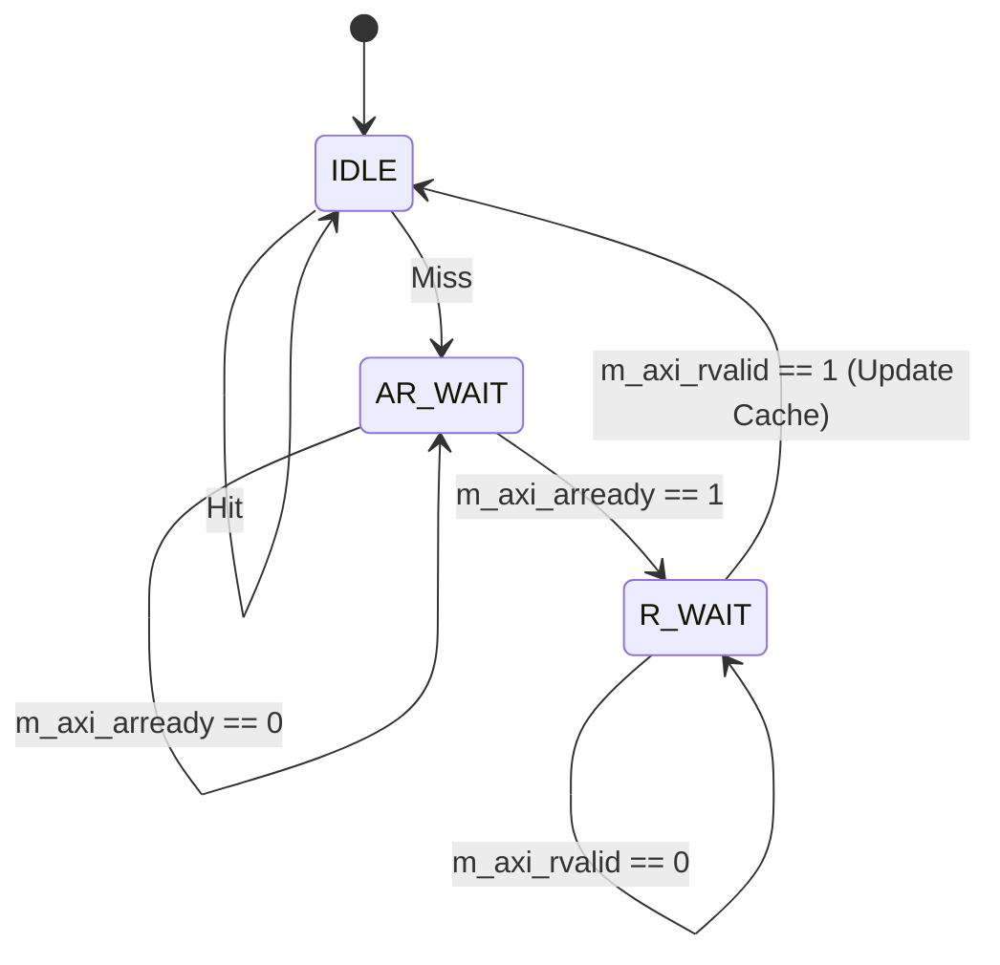
```mermaid
stateDiagram-v2
    [*] --> IDLE
    IDLE --> IDLE : Hit
    IDLE --> AR_WAIT : Miss
    
    AR_WAIT --> AR_WAIT : m_axi_arready == 0
    AR_WAIT --> R_WAIT : m_axi_arready == 1
    
    R_WAIT --> R_WAIT : m_axi_rvalid == 0
    R_WAIT --> IDLE : m_axi_rvalid == 1 (Update Cache)
```

---

## 19. L1 D-Cache — `l1_dcache`

### Bảng tín hiệu

| Tên | Hướng | Rộng | Ý nghĩa |
|---|---|---|---|
| `clk, rst_n` | Input | 1 | Clock, reset tích cực thấp |
| `cpu_addr` | Input | 32 | Địa chỉ dữ liệu |
| `cpu_wdata` | Input | 32 | Dữ liệu ghi (đã căn chỉnh) |
| `cpu_we` | Input | 1 | Write enable |
| `cpu_re` | Input | 1 | Read enable |
| `cpu_funct3` | Input | 3 | Kiểu store (sb/sh/sw) |
| `cpu_rdata` | Output | 32 | Dữ liệu đọc |
| `dcache_stall` | Output | 1 | 1 = stall toàn bộ pipeline |
| `m_axi_aw*, m_axi_w*, m_axi_b*` | Out/In | - | AXI4-Lite write channels |
| `m_axi_ar*, m_axi_r*` | Out/In | - | AXI4-Lite read channels |

### Cấu trúc cache

- **16 line, direct-mapped, write-back**
- Mỗi line: `data[31:0]`, `tag[25:0]`, `valid`, `dirty`
- index = addr[5:2], tag = addr[31:6]
- **6 trạng thái FSM**: IDLE → AW_WAIT → W_WAIT → B_WAIT → AR_WAIT → R_WAIT

### Nguyên lý hoạt động

- **Hit + Read**: trả về `cache_data[index]` ngay, không stall
- **Hit + Write**: cập nhật cache với write_mask, `dirty=1`, không stall
- **Miss + line sạch**: fetch từ SRAM (AR_WAIT → R_WAIT)
- **Miss + line bẩn**: evict về SRAM trước (AW_WAIT → B_WAIT), rồi fetch mới (AR_WAIT → R_WAIT)
- Khi stall: Hazard Unit đóng băng **tất cả 5 tầng**

#### Sơ đồ cấu trúc và FSM D-Cache

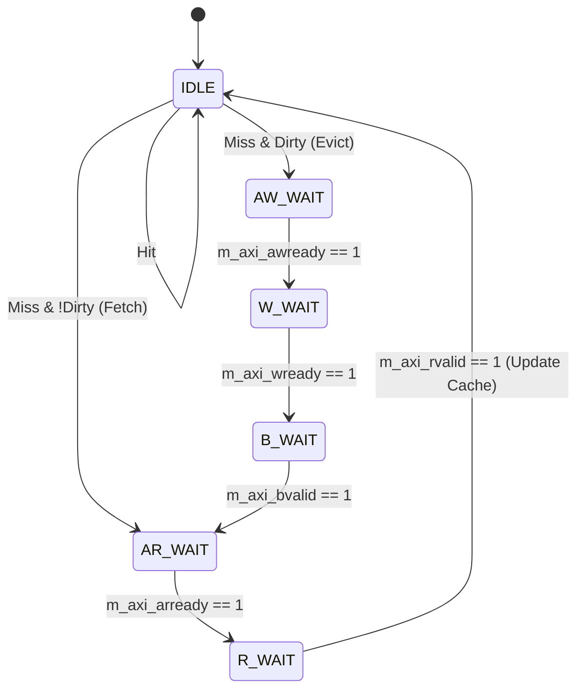
```mermaid
stateDiagram-v2
    [*] --> IDLE
    IDLE --> IDLE : Hit
    IDLE --> AW_WAIT : Miss & Dirty (Evict)
    IDLE --> AR_WAIT : Miss & !Dirty (Fetch)
    
    AW_WAIT --> W_WAIT : m_axi_awready == 1
    W_WAIT --> B_WAIT : m_axi_wready == 1
    B_WAIT --> AR_WAIT : m_axi_bvalid == 1
    
    AR_WAIT --> R_WAIT : m_axi_arready == 1
    R_WAIT --> IDLE : m_axi_rvalid == 1 (Update Cache)
```

---

## 20. AXI Interconnect — `axi_interconnect`

### Bảng tín hiệu

| Tên | Hướng | Rộng | Ý nghĩa |
|---|---|---|---|
| `m0_ar*, m0_r*` | In/Out | - | I-Cache (Master 0) — read only |
| `m1_aw*, m1_w*, m1_b*` | In/Out | - | D-Cache (Master 1) — write |
| `m1_ar*, m1_r*` | In/Out | - | D-Cache (Master 1) — read |
| `s0_*` | Out/In | - | SRAM Wrapper (Slave 0) |

### Nguyên lý hoạt động

- **Write**: D-Cache (M1) trực tiếp nối tới Slave 0. I-Cache không có write.
- **Read arbitration**: D-Cache (M1) được ưu tiên. M0 chỉ được phép nếu `m1_arvalid=0`.
- `current_r_owner` lưu master nào đang chờ read response, để routing đúng `rdata/rvalid` khi SRAM trả về.

#### Sơ đồ logic AXI Interconnect

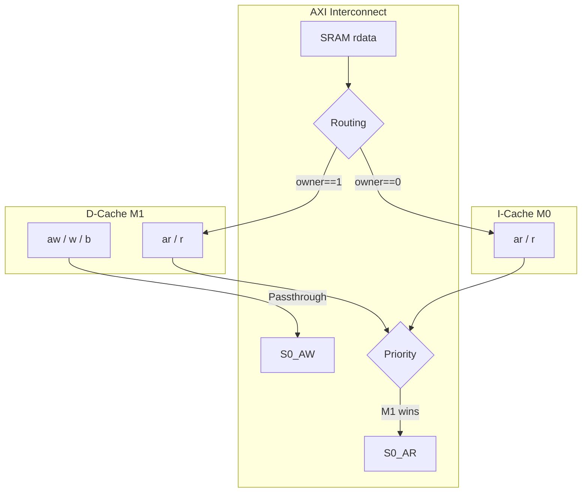
```mermaid
graph TD
    subgraph I-Cache M0
        AR0[ar / r]
    end
    
    subgraph D-Cache M1
        AW1[aw / w / b]
        AR1[ar / r]
    end
    
    subgraph AXI Interconnect
        AW1 -->|Passthrough| S0_AW
        
        AR1 --> PRIO{Priority}
        AR0 --> PRIO
        PRIO -->|M1 wins| S0_AR
        
        S0_R[SRAM rdata] --> ROUT{Routing}
        ROUT -->|owner==1| AR1
        ROUT -->|owner==0| AR0
    end
```

---

## 21. AXI SRAM Wrapper — `axi_sram_wrapper`

### Bảng tín hiệu

| Tên | Hướng | Rộng | Ý nghĩa |
|---|---|---|---|
| `s_axi_*` | In/Out | - | AXI4-Lite slave port |
| `sram_ad` | Output | 10 | Địa chỉ word cho SRAM (addr[11:2]) |
| `sram_di` | Output | 32 | Dữ liệu ghi vào SRAM |
| `sram_ben` | Output | 32 | Byte enable (32-bit, expand từ WSTRB 4-bit) |
| `sram_en` | Output | 1 | SRAM enable |
| `sram_r_wb` | Output | 1 | 1=Read, 0=Write |
| `sram_do` | Input | 32 | Dữ liệu đọc từ SRAM |

### Nguyên lý hoạt động

**3 trạng thái FSM**: IDLE → WRITE → IDLE (hoặc) IDLE → READ_WAIT → IDLE

- **Write**: IDLE nhận `awvalid && wvalid` → kích hoạt SRAM write → WRITE (gửi bresp) → IDLE
- **Read**: IDLE nhận `arvalid` → kích hoạt SRAM read → READ_WAIT (gửi rdata = sram_do) → IDLE
- SRAM trả dữ liệu sau 1 cycle (do SRAM đồng bộ với negedge clock: `CLKin = ~clk`)

#### Sơ đồ FSM AXI SRAM Wrapper

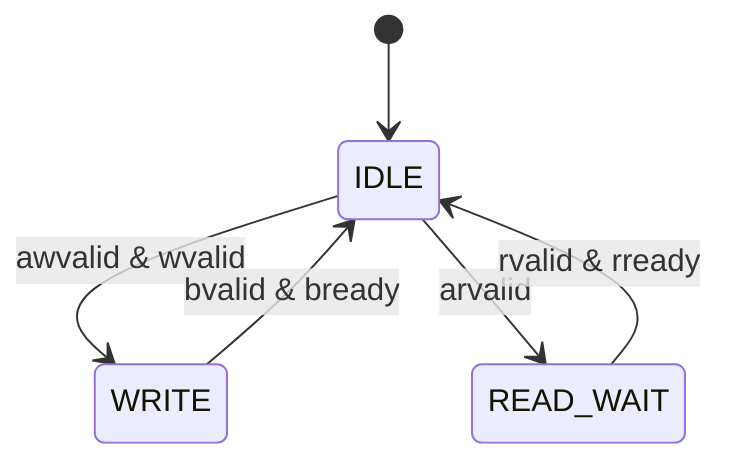
```mermaid
stateDiagram-v2
    [*] --> IDLE
    IDLE --> WRITE : awvalid & wvalid
    IDLE --> READ_WAIT : arvalid
    
    WRITE --> IDLE : bvalid & bready
    READ_WAIT --> IDLE : rvalid & rready
```

---

## 22. Tầng Issue — `issue`

### Bảng tín hiệu

| Tên | Hướng | Rộng | Ý nghĩa |
|---|---|---|---|
| `clk`, `rst`, `clr` | Input | 1 | Clock, Reset, Clear (flush_e) |
| `execute_ready` | Input | 1 | Tín hiệu Execute sẵn sàng nhận lệnh |
| `rd_e` | Input | 5 | Địa chỉ thanh ghi đích của lệnh ở tầng Execute |
| `result_src_e` | Input | 3 | Nguồn kết quả của lệnh ở Execute (kiểm tra lệnh Load) |
| `decode_valid` | Input | 1 | Tín hiệu lệnh ở tầng Decode hợp lệ |
| `reg_write_d`, `mem_write_d`, `alu_src_d`, `jump_d`, `branch_d`, `jalr_d` | Input | 1 | Các tín hiệu điều khiển từ Decode |
| `funct3_d`, `result_src_d`, `md_op_d` | Input | 3 | Tín hiệu điều khiển phụ từ Decode |
| `alu_control_d` | Input | 4 | Tín hiệu điều khiển ALU từ Decode |
| `read_data_1_d`, `read_data_2_d`, `pc_d`, `pc_plus_4_d`, `imm_ext_d`, `csr_rd_d` | Input | 32 | Dữ liệu từ tầng Decode |
| `rs1_d`, `rs2_d`, `rd_d` | Input | 5 | Các địa chỉ thanh ghi từ Decode |
| `csr_we_d`, `is_ecall_d`, `is_mret_d`, `md_req_d`, `is_illegal_d` | Input | 1 | Các tín hiệu CSR và exception từ Decode |
| `csr_addr_d` | Input | 12 | Địa chỉ CSR |
| `issue_stall` | Output| 1 | Báo hiệu dừng (stall) tầng Decode |
| `issue_valid` | Output| 1 | Báo hiệu lệnh đã được dispatch thành công xuống Execute |
| Các tín hiệu `_i` | Output| ... | Chuyển tiếp các tín hiệu điều khiển và dữ liệu cho tầng Execute |

### Nguyên lý hoạt động

Module `issue` đóng vai trò kiểm tra các điều kiện để có thể đẩy lệnh (dispatch) từ tầng Decode sang tầng Execute.
Module kiểm tra Load-Use Hazard trực tiếp giữa lệnh đang nằm ở tầng Decode và lệnh nằm ở tầng Execute.
Module cũng kiểm tra tín hiệu `execute_ready` (ví dụ tầng Execute không bị bận bởi bộ chia).
Nếu `execute_ready` = 1 và không có `load_use_hazard`, tín hiệu `can_dispatch` = 1.
Nếu không thể dispatch, module sẽ phát ra `issue_stall` = 1 để yêu cầu tầng Decode chờ.

#### Sơ đồ logic Tầng Issue

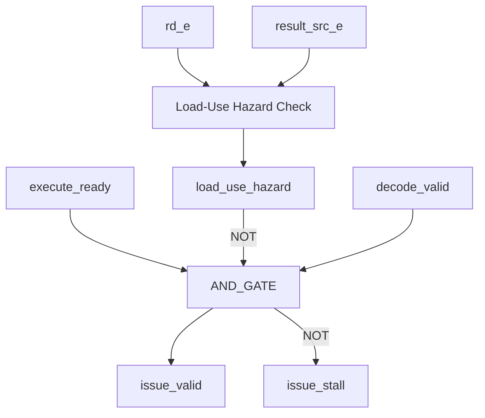
```mermaid
graph TD
    RD_E[rd_e] --> HAZARD[Load-Use Hazard Check]
    RSRC_E[result_src_e] --> HAZARD
    
    HAZARD --> LU[load_use_hazard]
    
    RDY[execute_ready] --> AND_GATE
    LU -->|NOT| AND_GATE
    VAL[decode_valid] --> AND_GATE
    
    AND_GATE --> IVAL[issue_valid]
    AND_GATE -->|NOT| ISTALL[issue_stall]
```

---

## 23. Khối Nhân/Chia (Mul/Div) — `muldiv_alu`

### Bảng tín hiệu

| Tên | Hướng | Rộng | Ý nghĩa |
|---|---|---|---|
| `clk`, `rst` | Input | 1 | Clock, Reset |
| `req` | Input | 1 | Tín hiệu yêu cầu bắt đầu tính toán |
| `ack` | Input | 1 | Tín hiệu xác nhận Pipeline đã nhận kết quả |
| `funct3` | Input | 3 | Xác định phép toán (MUL, MULH, DIV, REM, ...) |
| `a`, `b` | Input | 32 | Hai toán hạng 32-bit |
| `result` | Output| 32 | Kết quả tính toán |
| `busy` | Output| 1 | 1 = Module đang trong quá trình tính toán |
| `valid`| Output| 1 | 1 = Đã tính toán xong và kết quả hợp lệ |

### Nguyên lý hoạt động

Module `muldiv_alu` là bộ đồng xử lý nhân chia thực thi các phép toán trong tệp lệnh M-Extension.
Sử dụng FSM gồm các trạng thái `IDLE`, `MUL`, `DIV`, `DONE`.
- **Nhân (MUL):** Xử lý trong 1 chu kỳ thông qua phép nhân 64-bit tổ hợp.
- **Chia (DIV/REM):** Xử lý chuỗi (sequential) bằng thuật toán Shift-Subtract, mất 32 chu kỳ, hỗ trợ cả chia có dấu và không dấu. Có kiểm tra chia cho 0 và tràn số (overflow).
- Khi tính toán hoàn tất, module chuyển sang trạng thái `DONE`, giương cờ `valid` và đợi tín hiệu `ack` từ pipeline để quay về `IDLE`.

#### Sơ đồ logic FSM Mul/Div

```mermaid
stateDiagram-v2
    [*] --> IDLE
    IDLE --> MUL : req & is_mul
    IDLE --> DIV : req & (is_div | is_rem)
    
    MUL --> DONE : 1 cycle
    DIV --> DONE : 32 cycles
    
    DONE --> IDLE : ack
```

---

## 24. Mối quan hệ giữa các module

### Trong tầng Decode (ID)

```
                    ┌───────────────────────────────────────────────────┐
  instr_d ──────────┤  control_unit                                     │
                    │  ├─ main_decoder → reg_write, imm_src, alu_op, ...│
                    │  └─ alu_decoder → alu_control                     │
                    │                                                   │
  instr_d[19:15] ───┤  register_file (rs1, rs2)                         │
  result_w ─────────┤  register_file (write port WB)                    │
                    │                                                   │
  instr_d[31:0] ────┤  extend (imm_ext)                                 │
                    └───────────────────────────────────────────────────┘
```

### Trong tầng Execute (EX)

```
forward_a/b ───┐
               ├─→ mux_3_1 → src_a, src_b
read_data_1/2 ─┘
result_w ──────┘
alu_result_m ──┘

alu_src ───────→ mux(src_b_int, imm_ext) → src_b_final
alu_control ───→ ALU(src_a, src_b)
pc_e ──────────→ ALU input A (khi AUIPC)

funct3 ────────→ branch condition logic
branch_e ──────┤
jump_e ────────┼→ pc_src_e (flush signal)
jalr_e ────────┤
```

### Luồng dữ liệu xử lý Exception (ECALL)

```
1. ECALL ở tầng ID:  is_ecall_d = 1
2. fetch_cycle:       pc_next_final ← trap_vec (nhảy vào trap handler)
3. csr_file:          mepc ← pc_d, mcause ← 11 (hardware auto-update)
4. control_unit:      reg_write = 0 (ECALL không ghi thanh ghi)
```

#### Sơ đồ luồng ECALL / MRET

```mermaid
graph TD
    ID_E[ECALL tại ID] --> |is_ecall=1, reg_write=0| CSR_UPD[CSR: mepc=pc, mcause=11]
    CSR_UPD --> IF_TRAP[IF: pc_next = trap_vec]
    IF_TRAP --> HANDLER[Trap Handler]
    HANDLER --> ID_M[MRET tại ID]
    ID_M --> |is_mret=1, reg_write=0| IF_RET[IF: pc_next = mepc]
```

### Luồng xử lý Load-Use Hazard

```
Cycle N:   LW x1, 0(x2)  ← tầng EX, result_src_e[0]=1
Cycle N+1: ADD x3, x1, x4 ← tầng ID, rs1_d=x1=rd_e
           issue_stage:   load_use_hazard=1 → issue_stall=1, issue_valid=0
           hazard_unit:   stall_f=1, stall_d=1 (do issue_stall=1)
Cycle N+1: bubble chèn vào EX (do ~issue_valid làm flush_pipeline_2_3 = 1)
Cycle N+2: LW kết thúc MEM, forward x1 vào EX (ADD)
```

#### Sơ đồ Load-Use Hazard

| Chu kỳ (Cycle) | Tầng IF | Tầng ID | Tầng EX | Tầng MEM | Tầng WB | Trạng thái Hazard & Forwarding |
|---|---|---|---|---|---|---|
| **Cycle N** | NEXT | `ADD` | `LW` | (prev) | (prev) | Load-Use detected (`ADD` ở ID phụ thuộc `LW` ở EX) |
| **Cycle N+1** | NEXT *(stall)* | `ADD` *(stall)* | **BUBBLE** *(flush)* | `LW` | (prev) | `stall_f=1, stall_d=1`, chèn bubble vào EX (`flush_e=1`) |
| **Cycle N+2** | ... | NEXT | `ADD` | BUBBLE | `LW` | `ADD` vào EX. Dữ liệu `LW` được **Forward** từ WB → EX |
| **Cycle N+3** | ... | ... | NEXT | `ADD` | BUBBLE | Pipeline tiếp tục hoạt động bình thường |

### Luồng xử lý D-Cache Miss

```
MEM stage cần đọc/ghi nhưng D-Cache miss:
dcache_stall = 1
→ hazard_unit: stall_f=stall_d=stall_e=stall_m=stall_w = 1
→ Toàn bộ pipeline đóng băng
→ D-Cache FSM: (nếu dirty) evict → (rồi) fetch mới từ SRAM
→ dcache_stall = 0 sau khi hoàn thành
→ Pipeline tiếp tục
```

### Luồng ghi CSR (CSRRW)

```
1. Tầng ID:   csr_we_d=1, csr_addr_d=instr_d[31:20]
              csr_file đọc: csr_rd → qua pipeline → csr_rd_e
2. Tầng EX:   csr_alu tính csr_wd_e = src_a (hoặc zimm)
3. Tầng EX→M: csr_wd_e, csr_we_e, csr_addr_e → pipeline_3_4
4. Tầng M→W:  → pipeline_4_5
5. Tầng WB:   csr_file.csr_we=1, ghi csr_wd_w vào csr_addr_w
              result_src_w=11 → result_w = csr_rd_w (ghi vào rd)
```

#### Sơ đồ đường đi dữ liệu CSR

```
  ID           D/E         EX          E/M        MEM        M/W       WB
  ──           ───         ──          ───        ───        ───       ──
  csr_raddr ──▶csr_file
    (read)      │csr_rd ──▶ pipeline ──▶ csr_rd_e
                │              │               │
                │         src_a_fwd ──▶ csr_alu ──▶ csr_wd_e
                │                           │
                │                     pipeline_3_4 ──▶ csr_wd_m
                │                                          │
                │                                    pipeline_4_5 ──▶ csr_wd_w
                │                                                          │
                │                                              csr_file ◀──┘
                │                                              (write port)
                │                                              csr_we_w=1
                │
                └──▶ result_src_w=11 ──▶ result_w = csr_rd_w (ghi vào rd)
```
## 25. Branch Predictor — `branch_predictor`

### Bảng tín hiệu

| Tên | Hướng | Rộng | Ý nghĩa |
|---|---|---|---|
| `clk`, `rst` | Input | 1 | Clock, Reset |
| `pc_f` | Input | 32 | PC hiện tại ở tầng Fetch (dùng để tra cứu) |
| `predict_taken_f` | Output| 1 | Dự đoán có nhảy không |
| `predict_target_f` | Output| 32 | Địa chỉ đích dự đoán |
| `update_valid_e` | Input | 1 | Tín hiệu báo lệnh rẽ nhánh ở EX hợp lệ |
| `pc_e` | Input | 32 | PC của lệnh rẽ nhánh ở EX |
| `actual_taken_e` | Input | 1 | Thực tế có nhảy không |
| `actual_target_e` | Input | 32 | Địa chỉ đích thực tế |

### Nguyên lý hoạt động

Bộ Branch Predictor kết hợp Branch Target Buffer (BTB) và Branch History Table (BHT).
- **BTB (16 entries)**: Lưu trữ địa chỉ đích của nhánh. Index bằng `PC[5:2]`, Tag bằng `PC[31:6]`.
- **BHT (16 entries)**: Sử dụng bộ đếm bão hòa 2-bit (00=Strongly Not Taken, 01=Weakly Not Taken, 10=Weakly Taken, 11=Strongly Taken) để dự đoán nhánh.
- Tại tầng IF, dùng `pc_f` để tra cứu. Nếu hit BTB và BHT >= 10, dự đoán là Taken và lấy Target từ BTB.
- Tại tầng EX, dùng `pc_e`, `actual_taken_e`, `actual_target_e` để cập nhật BTB (nếu Taken) và cập nhật bộ đếm BHT (+1 nếu Taken, -1 nếu Not Taken).

#### Sơ đồ cấu trúc Branch Predictor

```mermaid
graph TD
    PC_F[pc_f] -->|Index 5:2| BTB_READ
    PC_F -->|Tag 31:6| BTB_READ
    
    subgraph BTB [Branch Target Buffer 16-entry]
        BTB_READ{Tag Match & Valid?}
        BTB_READ -->|Yes| BTB_TGT[Target]
    end
    
    PC_F -->|Index 5:2| BHT_READ
    
    subgraph BHT [Branch History Table 16-entry 2-bit]
        BHT_READ{Counter >= 2?}
    end
    
    BTB_READ --> AND_PRED{AND}
    BHT_READ --> AND_PRED
    
    AND_PRED -->|predict_taken_f| PRED_TAKEN
    BTB_TGT -->|predict_target_f| PRED_TGT
    
    PC_E[pc_e] -->|Index 5:2, Tag 31:6| UPDATE_LOGIC
    ACT_TAKEN[actual_taken_e] --> UPDATE_LOGIC
    ACT_TGT[actual_target_e] --> UPDATE_LOGIC
    UP_VALID[update_valid_e] --> UPDATE_LOGIC
    
    UPDATE_LOGIC -->|Write| BTB
    UPDATE_LOGIC -->|State Machine +1/-1| BHT
```
