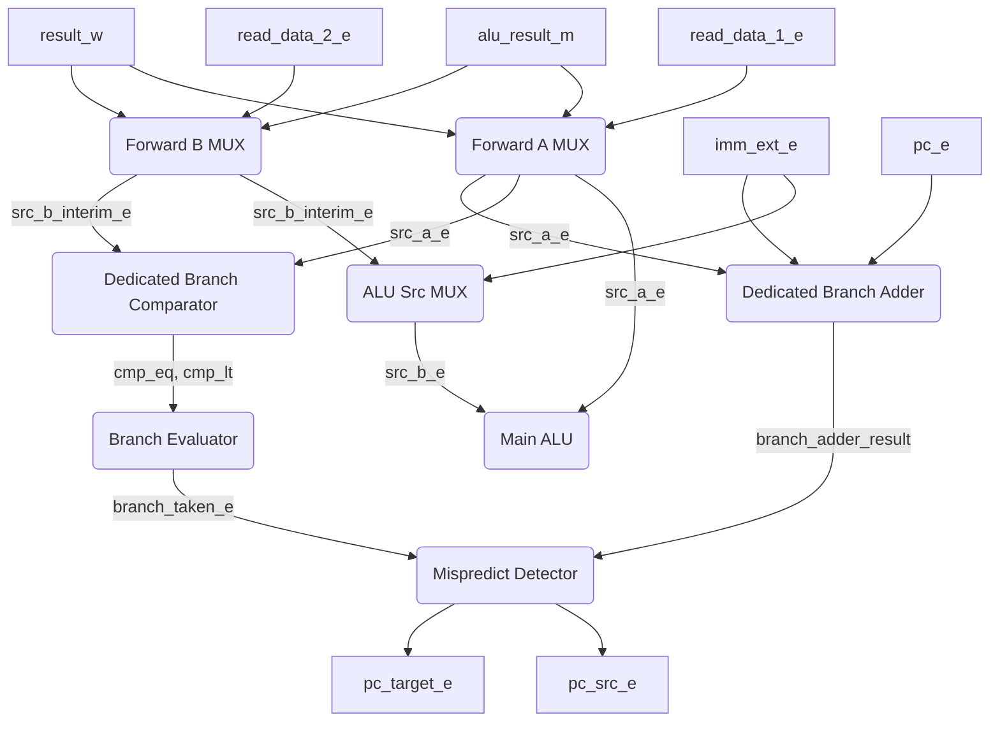
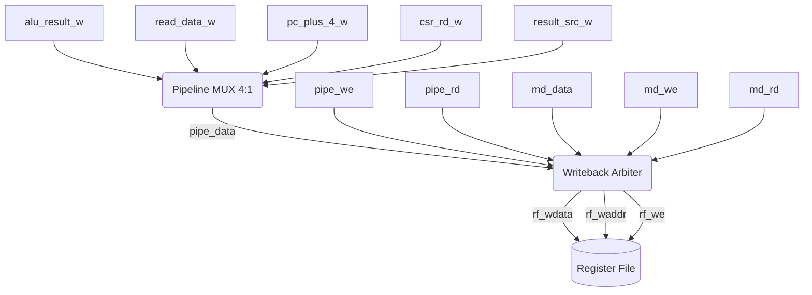
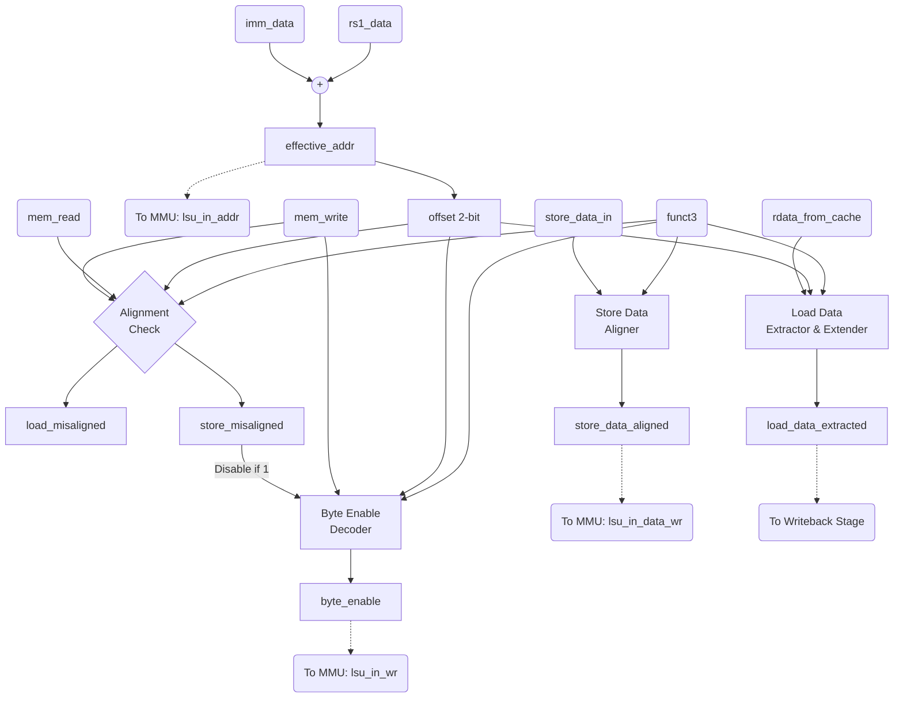

# RISC-V 5-Stage Pipelined Processor — Specification

---

## Tổng quan kiến trúc

Thiết kế này là một bộ xử lý RISC-V RV32I 5 tầng pipeline, bao gồm:
- 5 tầng pipeline: **IF → ID → EX → MEM → WB** (và Issue Stage kiểm soát)
- **Hazard Unit**: forwarding (MEM→EX, WB→EX), stall (load-use), flush (branch/jump)
- **L1 I-Cache** và **L1 D-Cache** nâng cao: 2-Way Set Associative, write-back, AXI4-Lite master
- **AXI4-Lite Interconnect** 2M→1S + **AXI SRAM Wrapper** → **EF_SRAM 1024×32**
- **AXI4 Full Master**: Hỗ trợ giao tiếp Burst tốc độ cao.
- **CSR File**: mstatus, mtvec, mscratch, mepc, mcause, satp + ECALL/MRET
- **MMU**: Đơn vị quản lý bộ nhớ dịch địa chỉ ảo Sv32 sang vật lý, hỗ trợ Supervisor Mode (S-Mode).
- **M-Extension**: Đơn vị tính toán nhân chia (muldiv_alu).

Tài liệu này được trình bày theo trình tự từ các khối chức năng nhỏ nhất (Datapath, Control) đến các tầng Pipeline, bộ nhớ, và cuối cùng là Top Module.

---

## 1. MUX — `mux` / `mux_3_1` / `mux_4to1`

---

## 2. Adder — `adder`

---

## 3. Extend — `extend`

---

## 4. Program Counter — `pc`

---

## 5. ALU — `alu`

---

## 6. Register File — `register_file`

---

## 7. ALU Decoder — `alu_decoder`

---

## 8. Main Decoder — `main_decoder`

---

## 9. Đơn vị điều khiển — `control_unit`

---

## 10. Hazard Unit — `hazard_unit`

---

## 11. CSR ALU — `csr_alu`

---

## 12. CSR File — `csr_file`

---

## 13. Khối Nhân/Chia (Mul/Div) — `muldiv_alu`

### 13.1. Chức năng (Purpose)
Bộ đồng xử lý (Coprocessor) đảm nhiệm các lệnh toán học phức tạp thuộc M-Extension của kiến trúc RISC-V:
- Phép nhân: `MUL`, `MULH`, `MULHSU`, `MULHU`.
- Phép chia: `DIV`, `DIVU`, `REM`, `REMU`.
Khối này nhận tín hiệu `req` từ Execute Stage, xử lý tính toán trong nhiều chu kỳ và trả về kết quả kèm cờ `valid`, đồng thời kích hoạt `busy` để báo cho Hazard Unit làm ngưng đọng (stall) Pipeline.

### 13.2. Số chu kỳ thực thi thực tế (Execution Cycles)
Trái với mô tả rút gọn, phần cứng thực tế sử dụng thuật toán MAC 17x17-bit (chia nhỏ toán hạng 32-bit thành 2 nửa 16-bit) và thuật toán chia Non-restoring/Restoring division. Số chu kỳ chính xác từ lúc `req` = 1 đến khi `valid` = 1:
- **Lệnh MUL (Lấy 32 bit thấp)**: Cần **5 chu kỳ** (`IDLE` $\rightarrow$ `MUL_ALBL` $\rightarrow$ `MUL_ALBH` $\rightarrow$ `MUL_AHBL` $\rightarrow$ `MUL_DONE` $\rightarrow$ `DONE`).
- **Lệnh MULH/MULHSU/MULHU (Lấy 32 bit cao)**: Cần **6 chu kỳ** (Thêm state `MUL_AHBH` để tính đầy đủ 64-bit).
- **Lệnh DIV/REM thông thường**: Cần **34 chu kỳ** (1 chu kỳ khởi tạo $\rightarrow$ 32 chu kỳ dịch trừ $\rightarrow$ 1 chu kỳ chốt dấu và chuyển sang `DONE`).
- **Lệnh DIV/REM chia cho 0 hoặc Overflow**: Chỉ tốn **2 chu kỳ** do được bypass (Bỏ qua đếm 32 chu kỳ dịch trừ).

### 13.3. Nguyên lý hoạt động (Operation)
- **Multiplication**: `mul_op_a` và `mul_op_b` lần lượt nạp các khối 16-bit thấp (AL/BL) và cao (AH/BH). Tích 34-bit của mỗi chu kỳ được dịch đúng vị trí và cộng dồn vào thanh ghi `mac_res` 64-bit. Đối với lệnh `MUL` chỉ lấy 32 bit thấp, thuật toán bỏ qua lần nhân `AH*BH` để tiết kiệm 1 chu kỳ.
- **Division**: Sử dụng thuật toán Shift-Subtract với thanh ghi 64-bit kép `div_q` và `div_r`. Biến `count` đếm ngược 32 lần. Các toán hạng được chuyển thành trị tuyệt đối (Absolute) trước khi chia, và kết quả sẽ được hoàn dấu lại tại chu kỳ cuối cùng tùy theo quy tắc dấu của lệnh ban đầu.

---

## 14. Branch Predictor — `branch_predictor`

---

## 15. RISC-V MMU — `riscv_mmu`

---

## 16. AXI SRAM Wrapper — `axi_sram_wrapper`

---

## 17. EF SRAM — `EF_SRAM_1024x32`

---

## 18. AXI Interconnect — `axi_interconnect`

---

## 19. L1 I-Cache — `l1_icache`

---

## 20. L1 D-Cache — `l1_dcache`

---

## 21. AXI4 Full Master — `axi4_full_master`

---

## 22. Tầng Fetch — `fetch_cycle`

---

## 23. Tầng Decode — `decode_cycle`

---

## 24. Tầng Issue — `issue`

---

## 25. Tầng Execute — `execute_cycle`

### 25.1. Chức năng (Purpose)
Tầng Execute (EX) là nơi thực hiện các phép tính số học/logic (ALU) và phân giải nhánh (Branch Resolution). Kể từ phiên bản tối ưu kiến trúc mới nhất, `execute_cycle` đã tách biệt hoàn toàn Branch Comparator và Branch Adder ra khỏi ALU chính. ALU chính giờ đây chỉ thực hiện các lệnh toán học và logic, không còn bị chia sẻ để tính Branch Target hay tính cờ so sánh Branch nữa. Nhờ vậy, Critical Path của hệ thống được rút ngắn đáng kể.

### 25.2. Bảng tín hiệu (I/O Interface)

| Tên tín hiệu | Hướng | Độ rộng | Chức năng |
|---|---|---|---|
| `forward_a_e` / `forward_b_e` | Input | 2-bit | Tín hiệu từ Hazard Unit để chọn nguồn forwarding (00: RF, 01: WB, 10: MEM). |
| `jump_e`, `branch_e`, `jalr_e` | Input | 1-bit | Các cờ báo hiệu lệnh nhảy hoặc rẽ nhánh. |
| `funct3_e` | Input | 3-bit | Dùng để phân giải điều kiện rẽ nhánh (BEQ, BNE, BLT...). |
| `alu_control_e` | Input | 4-bit | Tín hiệu điều khiển ALU chính. |
| `read_data_1_e`, `read_data_2_e` | Input | 32-bit | Dữ liệu từ Register File đã nạp. |
| `alu_result_m`, `result_w` | Input | 32-bit | Dữ liệu Forwarding từ tầng MEM và WB. |
| `imm_ext_e` | Input | 32-bit | Giá trị Immediate đã mở rộng. |
| `pc_e`, `pc_plus_4_e` | Input | 32-bit | Giá trị PC hiện tại và PC kế tiếp. |
| `predict_taken_e`, `predict_target_e` | Input | 1-bit, 32-bit| Kết quả từ bộ Branch Predictor (để kiểm tra xem có mispredict không). |
| `pc_target_e` | Output | 32-bit | Địa chỉ đích sẽ dùng để redirect PC nếu mispredict. |
| `pc_src_e` | Output | 1-bit | Cờ Misprediction, gửi lên IF để flush ống lệnh. |
| `alu_result_e` | Output | 32-bit | Kết quả từ ALU chính. |
| `actual_taken_e`, `actual_target_e` | Output | 1-bit, 32-bit| Kết quả Branch thức tế dùng để cập nhật lại Branch Predictor. |

### 25.3. Nguyên lý hoạt động (Operation)
1. **Forwarding:** Dữ liệu nguồn A và B được cho qua hai bộ Mux (`src_a_emux`, `src_b_interim_e_mux`) để lấy giá trị mới nhất (chống Data Hazard).
2. **Branch Resolution (Decoupled):** Dữ liệu sau Forwarding đi thẳng vào một cụm logic so sánh bằng (`==`) và nhỏ hơn (`<`) độc lập. Kết quả so sánh kết hợp với `funct3_e` để tạo cờ `branch_taken_e`.
3. **Branch Target (Decoupled):** Lệnh Branch dùng `pc_e + imm`, lệnh JALR dùng `rs1 + imm`. Bộ Dedicated Branch Adder được dùng riêng cho việc này thông qua bộ Mux chọn `jalr_e ? src_a_e : pc_e`.
4. **Misprediction Detection:** So sánh nhánh rẽ thực tế (`actual_taken_e`, `actual_target_e`) với dự đoán ban đầu (`predict_taken_e`, `predict_target_e`). Nếu sai, bật `pc_src_e` để ép IF nhảy về đúng chỗ.

### 25.4. Sơ đồ logic (Logic Diagram)

## 26. Tầng Memory — `memory_cycle`

---

## 27. Tầng Writeback — `writeback_cycle` & `writeback_arbiter`

### 27.1. Chức năng (Purpose)
Tầng Writeback (WB) là chốt cuối cùng của đường ống (pipeline), có nhiệm vụ thu thập kết quả từ nhiều đơn vị thực thi (ALU, LSU, CSR, MULDIV) và quyết định dữ liệu nào sẽ được ghi vào Register File (RF).
Trong thiết kế tối ưu mới nhất, Writeback Network đã được tái cấu trúc thành một `writeback_arbiter` duy nhất, giúp gom toàn bộ luồng Writeback lại thành một cổng Writeback duy nhất cho Register File.

### 27.2. Bảng tín hiệu (I/O Interface)

**Khối `writeback_cycle` (Pipeline chính):**
| Tên tín hiệu | Hướng | Độ rộng | Chức năng |
|---|---|---|---|
| `result_src_w` | Input | 3-bit | Nguồn dữ liệu chọn (000: ALU, 001: MEM, 010: PC+4, 011: CSR). |
| `alu_result_w` | Input | 32-bit | Kết quả từ ALU/AGU. |
| `read_data_w` | Input | 32-bit | Dữ liệu nạp từ bộ nhớ. |
| `pc_plus_4_w` | Input | 32-bit | Dùng cho lệnh JAL/JALR để lưu địa chỉ quay lại. |
| `csr_rd_w` | Input | 32-bit | Dữ liệu từ CSR File. |
| `result_w` | Output | 32-bit | Dữ liệu chốt cuối cùng của đường ống pipeline. |

**Khối `writeback_arbiter` (Thu thập tất cả nguồn):**
| Tên tín hiệu | Hướng | Độ rộng | Chức năng |
|---|---|---|---|
| `pipe_we`, `pipe_rd`, `pipe_data`| Input | 1, 5, 32 | Tín hiệu Write Enable, địa chỉ RD, và Data từ đường ống chính (kết quả của `writeback_cycle`). |
| `md_we`, `md_rd`, `md_data` | Input | 1, 5, 32 | Tín hiệu từ khối MULDIV. Khối này thực thi ngoài đường ống. |
| `rf_we`, `rf_waddr`, `rf_wdata` | Output | 1, 5, 32 | Tín hiệu điều khiển cổng Writeback duy nhất kết nối vào Register File. |

### 27.3. Nguyên lý hoạt động (Operation)
1. **MUX Nguồn Pipeline:** Module `writeback_cycle` dùng `mux_4to1` để chọn giữa ALU (`000`), Load Data (`001`), PC+4 (`010`), CSR (`011`). Output là `result_w`.
2. **Arbiter Tổng hợp:** Để tránh Register File phải mở nhiều cổng (gây tốn Area và phức tạp dây dẫn), `writeback_arbiter` làm nhiệm vụ ưu tiên. Nếu MULDIV tính xong (`md_we` = 1), MULDIV sẽ được chọn ghi. Nếu không, pipeline chính sẽ được ghi.

### 27.4. Sơ đồ logic (Logic Diagram)

## 28. Các thanh ghi Pipeline

---

## 29. RVFI Tracer — `rvfi_tracer`

---

## 30. Top Module — `riscv_pipeline_top`

---

## 31. Load Store Unit — `lsu`

### 31.1. Chức năng (Purpose)
- Đóng vai trò là khối trung gian quản lý toàn bộ Memory Access nằm ở đầu Memory Stage.
- Tính toán địa chỉ bộ nhớ (`effective_addr`), dóng hàng dữ liệu ghi (`store_data_aligned`), sinh byte mask (`byte_enable`), và trích xuất dữ liệu đọc (`load_data_extracted`).
- Kiểm tra tính hợp lệ của địa chỉ và phát ra các cờ ngoại lệ (`load_misaligned`, `store_misaligned`).

### 31.2. Bảng tín hiệu (I/O Interface)

| Tên tín hiệu | Hướng | Độ rộng | Chức năng |
|---|---|---|---|
| `rs1_data` | Input | 32-bit | Giá trị thanh ghi cơ sở từ EX stage (dùng tạo địa chỉ) |
| `imm_data` | Input | 32-bit | Giá trị immediate mở rộng (dùng tạo địa chỉ) |
| `mem_read` | Input | 1-bit | Cờ báo hiệu lệnh Load |
| `mem_write` | Input | 1-bit | Cờ báo hiệu lệnh Store |
| `funct3` | Input | 3-bit | Mã định nghĩa kích thước thao tác (B/H/W) và kiểu mở rộng (có/không dấu) |
| `store_data_in` | Input | 32-bit | Dữ liệu gốc cần ghi (đọc từ `rs2`) |
| `rdata_from_cache`| Input | 32-bit | Dữ liệu word (32-bit) trả về từ Cache/MMU |
| `effective_addr` | Output| 32-bit | Địa chỉ bộ nhớ ảo truyền tới MMU (`rs1_data + imm_data`) |
| `byte_enable` | Output| 4-bit | Write mask tương ứng với vị trí byte cần ghi (gửi tới MMU/Cache) |
| `store_data_aligned`| Output| 32-bit | Dữ liệu ghi đã được nhân bản (`{byte, byte, byte, byte}`) để Cache ghi theo mask |
| `load_data_extracted`| Output| 32-bit | Dữ liệu đã trích xuất đúng offset và được mở rộng (Sign/Zero Extend) |
| `load_misaligned` | Output| 1-bit | Cờ ngoại lệ báo địa chỉ Load không hợp lệ (lệch biên) |
| `store_misaligned`| Output| 1-bit | Cờ ngoại lệ báo địa chỉ Store không hợp lệ (lệch biên) |

### 31.3. Nguyên lý hoạt động (Operation)
- **Address Generation (Tạo địa chỉ)**: Bộ cộng nội bộ tính toán `effective_addr = rs1_data + imm_data`.
- **Alignment Check (Kiểm tra biên)**: Trích xuất 2 bit cuối của `effective_addr` (`offset`). Phép truy cập Word (`funct3 = 010`) yêu cầu `offset == 00`. Phép truy cập Halfword (`funct3 = 001/101`) yêu cầu `offset[0] == 0`. Nếu vi phạm và có cờ `mem_read`/`mem_write`, LSU xuất ngoại lệ tương ứng và ngắt mask `byte_enable = 0`.
- **Store Flow (Luồng ghi)**:
  - Sinh `byte_enable` dựa trên `funct3` (độ dài) và `offset` (vị trí lệch).
  - Khối Data Alignment nhân bản byte (`{store_data_in[7:0], store_data_in[7:0], ...}`) hoặc halfword để lấp đầy 32-bit. Cache sẽ áp dụng mask `byte_enable` để chỉ ghi vào đúng vị trí cần thiết.
- **Load Flow (Luồng đọc)**:
  - LSU nhận `rdata_from_cache` nguyên word 32-bit.
  - Khối Data Extraction dựa vào `offset` để trích xuất ra byte hoặc halfword cụ thể.
  - Khối Extension dựa vào `funct3` để giữ nguyên (LW), Sign-Extend (LB, LH) hoặc Zero-Extend (LBU, LHU).

### 31.4. Sơ đồ logic (Logic Diagram)

