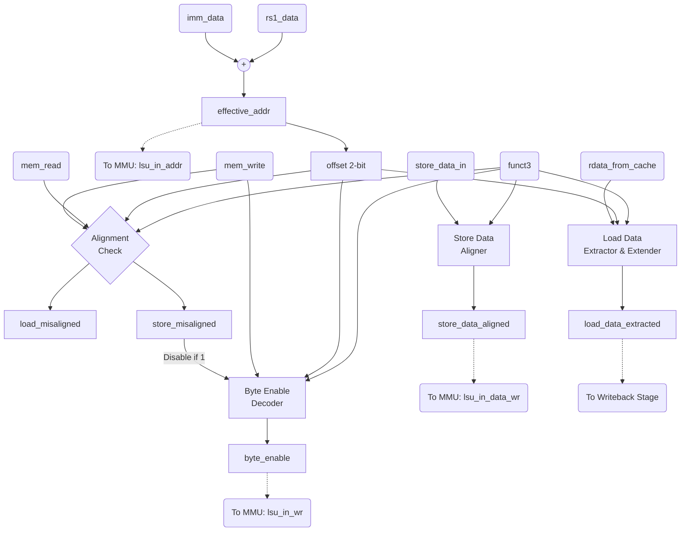

# RISC-V 5-Stage Pipelined Processor — Specification

---

## Tổng quan kiến trúc

Thiết kế này là một bộ xử lý RISC-V RV32I 5 tầng pipeline, bao gồm:
- 5 tầng pipeline: **IF → ID → EX → MEM → WB** (và Issue Stage kiểm soát)
- **Hazard Unit**: forwarding (MEM→EX, WB→EX), stall (load-use), flush (branch/jump)
- **L1 I-Cache** và **L1 D-Cache** nâng cao: 2-Way Set Associative, write-back, AXI4-Lite master
- **AXI4-Lite Interconnect** 2M→1S + **AXI SRAM Wrapper** → **EF_SRAM 1024×32**
- **AXI4 Full Master**: Hỗ trợ giao tiếp Burst tốc độ cao.
- **CSR File**: mstatus, mtvec, mscratch, mepc, mcause, satp + ECALL/MRET
- **MMU**: Đơn vị quản lý bộ nhớ dịch địa chỉ ảo Sv32 sang vật lý, hỗ trợ Supervisor Mode (S-Mode).
- **M-Extension**: Đơn vị tính toán nhân chia (muldiv_alu).

Tài liệu này được trình bày theo trình tự từ các khối chức năng nhỏ nhất (Datapath, Control) đến các tầng Pipeline, bộ nhớ, và cuối cùng là Top Module.

---

## 1. MUX — `mux` / `mux_3_1` / `mux_4to1`

---

## 2. Adder — `adder`

---

## 3. Extend — `extend`

---

## 4. Program Counter — `pc`

---

## 5. ALU — `alu`

---

## 6. Register File — `register_file`

---

## 7. ALU Decoder — `alu_decoder`

---

## 8. Main Decoder — `main_decoder`

---

## 9. Đơn vị điều khiển — `control_unit`

---

## 10. Hazard Unit — `hazard_unit`

---

## 11. CSR ALU — `csr_alu`

---

## 12. CSR File — `csr_file`

---

## 13. Khối Nhân/Chia (Mul/Div) — `muldiv_alu`

---

## 14. Branch Predictor — `branch_predictor`

---

## 15. RISC-V MMU — `riscv_mmu`

---

## 16. AXI SRAM Wrapper — `axi_sram_wrapper`

---

## 17. EF SRAM — `EF_SRAM_1024x32`

---

## 18. AXI Interconnect — `axi_interconnect`

---

## 19. L1 I-Cache — `l1_icache`

---

## 20. L1 D-Cache — `l1_dcache`

---

## 21. AXI4 Full Master — `axi4_full_master`

---

## 22. Tầng Fetch — `fetch_cycle`

---

## 23. Tầng Decode — `decode_cycle`

---

## 24. Tầng Issue — `issue`

---

## 25. Tầng Execute — `execute_cycle`

---

## 26. Tầng Memory — `memory_cycle`

---

## 27. Tầng Writeback — `writeback_cycle`

---

## 28. Các thanh ghi Pipeline

---

## 29. RVFI Tracer — `rvfi_tracer`

---

## 30. Top Module — `riscv_pipeline_top`

---

## 31. Load Store Unit — `lsu`

### 31.1. Chức năng (Purpose)
- Đóng vai trò là khối trung gian quản lý toàn bộ Memory Access nằm ở đầu Memory Stage.
- Tính toán địa chỉ bộ nhớ (`effective_addr`), dóng hàng dữ liệu ghi (`store_data_aligned`), sinh byte mask (`byte_enable`), và trích xuất dữ liệu đọc (`load_data_extracted`).
- Kiểm tra tính hợp lệ của địa chỉ và phát ra các cờ ngoại lệ (`load_misaligned`, `store_misaligned`).

### 31.2. Bảng tín hiệu (I/O Interface)

| Tên tín hiệu | Hướng | Độ rộng | Chức năng |
|---|---|---|---|
| `rs1_data` | Input | 32-bit | Giá trị thanh ghi cơ sở từ EX stage (dùng tạo địa chỉ) |
| `imm_data` | Input | 32-bit | Giá trị immediate mở rộng (dùng tạo địa chỉ) |
| `mem_read` | Input | 1-bit | Cờ báo hiệu lệnh Load |
| `mem_write` | Input | 1-bit | Cờ báo hiệu lệnh Store |
| `funct3` | Input | 3-bit | Mã định nghĩa kích thước thao tác (B/H/W) và kiểu mở rộng (có/không dấu) |
| `store_data_in` | Input | 32-bit | Dữ liệu gốc cần ghi (đọc từ `rs2`) |
| `rdata_from_cache`| Input | 32-bit | Dữ liệu word (32-bit) trả về từ Cache/MMU |
| `effective_addr` | Output| 32-bit | Địa chỉ bộ nhớ ảo truyền tới MMU (`rs1_data + imm_data`) |
| `byte_enable` | Output| 4-bit | Write mask tương ứng với vị trí byte cần ghi (gửi tới MMU/Cache) |
| `store_data_aligned`| Output| 32-bit | Dữ liệu ghi đã được nhân bản (`{byte, byte, byte, byte}`) để Cache ghi theo mask |
| `load_data_extracted`| Output| 32-bit | Dữ liệu đã trích xuất đúng offset và được mở rộng (Sign/Zero Extend) |
| `load_misaligned` | Output| 1-bit | Cờ ngoại lệ báo địa chỉ Load không hợp lệ (lệch biên) |
| `store_misaligned`| Output| 1-bit | Cờ ngoại lệ báo địa chỉ Store không hợp lệ (lệch biên) |

### 31.3. Nguyên lý hoạt động (Operation)
- **Address Generation (Tạo địa chỉ)**: Bộ cộng nội bộ tính toán `effective_addr = rs1_data + imm_data`.
- **Alignment Check (Kiểm tra biên)**: Trích xuất 2 bit cuối của `effective_addr` (`offset`). Phép truy cập Word (`funct3 = 010`) yêu cầu `offset == 00`. Phép truy cập Halfword (`funct3 = 001/101`) yêu cầu `offset[0] == 0`. Nếu vi phạm và có cờ `mem_read`/`mem_write`, LSU xuất ngoại lệ tương ứng và ngắt mask `byte_enable = 0`.
- **Store Flow (Luồng ghi)**:
  - Sinh `byte_enable` dựa trên `funct3` (độ dài) và `offset` (vị trí lệch).
  - Khối Data Alignment nhân bản byte (`{store_data_in[7:0], store_data_in[7:0], ...}`) hoặc halfword để lấp đầy 32-bit. Cache sẽ áp dụng mask `byte_enable` để chỉ ghi vào đúng vị trí cần thiết.
- **Load Flow (Luồng đọc)**:
  - LSU nhận `rdata_from_cache` nguyên word 32-bit.
  - Khối Data Extraction dựa vào `offset` để trích xuất ra byte hoặc halfword cụ thể.
  - Khối Extension dựa vào `funct3` để giữ nguyên (LW), Sign-Extend (LB, LH) hoặc Zero-Extend (LBU, LHU).

### 31.4. Sơ đồ logic (Logic Diagram)

